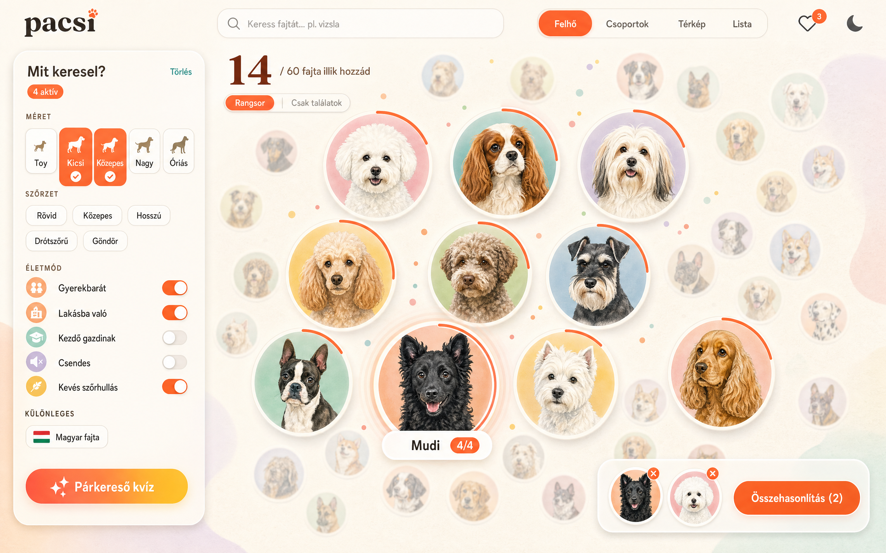
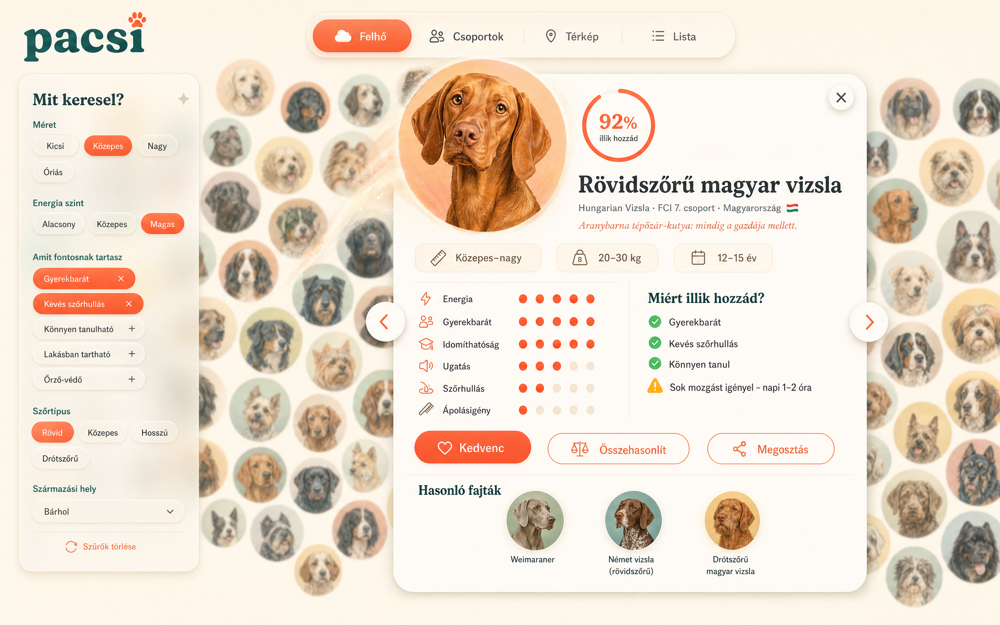
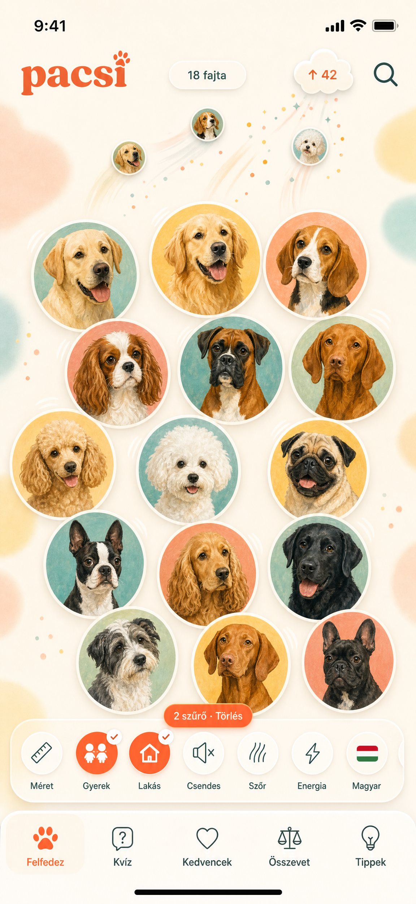
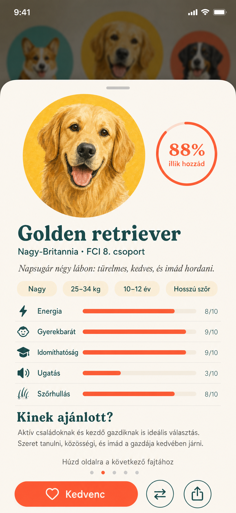

# 🐾 Pacsi by DarwinAI — Kutyafajta-választó web & PWA

### Részletes termék-, UX/UI- és animációs specifikáció · v1.0

| | |
|---|---|
| **Név** | **Pacsi by DarwinAI** („Találd meg a hozzád illő kutyát”) |
| **Fejlesztő** | DarwinAI – [www.darwinai.hu](https://www.darwinai.hu) |
| **Platformok** | Laptop/desktop weboldal + mobil PWA (telepíthető, offline) |
| **Megoldás típusa** | Standalone HTML, adatbázis és backend nélkül |
| **Nyelv** | Magyar (később EN/DE) |
| **Dokumentum dátuma** | 2026-09-23 |
| **Státusz** | Tervezet – fejlesztés előtti specifikáció |
| **Kapcsolódó képek** | [`mockups/`](mockups/) – laptop és mobil képernyőtervek |

---

## Tartalomjegyzék

1. [Összefoglaló](#1-összefoglaló)
2. [Mit változtattam / tettem hozzá a vázlathoz képest](#2-mit-változtattam--tettem-hozzá-a-vázlathoz-képest)
3. [Célok, sikermutatók](#3-célok-sikermutatók)
4. [Célcsoport és perszónák](#4-célcsoport-és-perszónák)
5. [Termékkoncepció: a „Fajtafelhő”](#5-termékkoncepció-a-fajtafelhő)
6. [Információs architektúra és navigáció](#6-információs-architektúra-és-navigáció)
7. [Tartalom: a 124 fajta](#7-tartalom-a-124-fajta)
8. [Szűrők és kategorizálás](#8-szűrők-és-kategorizálás)
9. [Vizuális design rendszer](#9-vizuális-design-rendszer)
10. [Laptop / desktop UI](#10-laptop--desktop-ui)
11. [Mobil PWA UI](#11-mobil-pwa-ui)
12. [Mozgás- és animációs rendszer](#12-mozgás--és-animációs-rendszer)
13. [Buborék-elrendezési algoritmus](#13-buborék-elrendezési-algoritmus)
14. [Kiegészítő funkciók](#14-kiegészítő-funkciók)
15. [Adatmodell](#15-adatmodell)
16. [Képanyag: portrék generálása](#16-képanyag-portrék-generálása)
17. [Technikai architektúra](#17-technikai-architektúra)
18. [PWA: „mintha natív app lenne”](#18-pwa-mintha-natív-app-lenne)
19. [Akadálymentesség](#19-akadálymentesség)
20. [Szövegezés és hangnem](#20-szövegezés-és-hangnem)
21. [Etika, jog, adatvédelem](#21-etika-jog-adatvédelem)
22. [Népszerűség és növekedés](#22-népszerűség-és-növekedés)
23. [Ütemezés (roadmap) és elfogadási feltételek](#23-ütemezés-roadmap-és-elfogadási-feltételek)
24. [Nyitott kérdések](#24-nyitott-kérdések)
25. [Mellékletek: mockupok](#25-mellékletek-mockupok)
26. [Megvalósítás állapota (v1.0 build)](#26-megvalósítás-állapota-v10-build)

---

## 1. Összefoglaló

A **pacsi** egy vizuális, játékos, mégis megbízható kutyafajta-választó azoknak, akik kutya vásárlását vagy örökbefogadását tervezik. A képernyőn **124 népszerű, Európában tartott fajta** lebeg kis kör alakú portréként – ez a **Fajtafelhő**. A felhasználó szűrőket kapcsol be (méret, szőrzet, gyerekbarát, lakásba való, csendes stb.), a felhő pedig **élő animációval reagál**:

- **Laptopon** a megfelelő fajták **előreugranak**: nagyobbak lesznek, középre sodródnak, izzó gyűrűt kapnak. A többi fajta **hátrébb lép**: kicsi, fakó és enyhén elmosódott lesz (mélységélesség). Minden újabb szűrővel a legjobb találatok még előrébb jönnek.
- **Mobilon** a nem megfelelő fajták **felfelé kirepülnek** a képernyőről egy „felhő” jelvénybe, a maradék buborékok pedig **megnőnek** és kitöltik a helyet. Ha a szűrőt kikapcsolod, a kirepült fajták **visszahullanak**.

Egy buborékra kattintva **fajtakártya** nyílik: nagy portré, leírás, jellemzők, illeszkedés %-ban, és egy „miért illik hozzád” lista. A felhőt ki lehet egészíteni a **Párkereső kvízzel**, a **csoportos és térképes nézettel**, **összehasonlítással**, **kedvencekkel** és **megosztható eredménykártyával**.

Az egész egyetlen, adatbázis nélküli HTML-alkalmazás. Az adatok és a képek bele vannak ágyazva. Hosztolva telepíthető **PWA**, amely **teljesen offline** is működik.

> **Az egyedi érték:** nem táblázatot vagy kvízt kapsz, hanem azt **látod**, ahogy a döntéseid formálják a lehetőségek felhőjét. Ettől lesz élmény, és ezért érdemes megosztani.

---

## 2. Mit változtattam / tettem hozzá a vázlathoz képest

A vázlat alapötletei maradnak: kör alakú portrék, hoverre név, kattintásra kártya, előreugrás laptopon, kirepülés mobilon, szűrők ikonokkal. A következőket javaslom hozzá:

| # | Javaslat | Miért jobb |
|---|---|---|
| 1 | **Két szűrési mód: „Rangsor” (puha) és „Csak találatok” (szigorú)** – mindkét platformon elérhető. Laptopon a Rangsor, mobilon a Csak találatok az alapértelmezett. | Laptopon a „mélység” megmutatja a *majdnem* jó fajtákat is (a döntés nem fekete-fehér). Mobilon a kirepülés helyet szabadít fel. A felhasználó bármikor átválthat. |
| 2 | **Folytonos illeszkedési pontszám (0–100%)**, nem csak igen/nem | A buborék mérete, mélysége és gyűrűje finoman skálázódik. A kártyán megjelenik, *miért* ennyi. |
| 3 | **Hullámeffekt**: a szűrőre kattintáskor a reakció a szűrőpanel felől végigfut a felhőn | A felhasználó látja az ok-okozati kapcsolatot („ezt én csináltam”). Ez a legerősebb „wow”-pillanat. |
| 4 | **Kirepült-számláló felhő (mobil)**: a kirepülő buborékok egy „↑ 42” jelvénybe érkeznek | A buborékok nem tűnnek el a semmibe: látszik, hová mentek, és egy koppintással visszanézhetők. |
| 5 | **Okos „üres állapot”**: ha 0 találat marad, a rendszer megmondja, melyik szűrő elengedésével hány fajta jönne vissza | Nincs zsákutca, a felhasználó nem hagyja ott az oldalt. |
| 6 | **Nézetek: Felhő / Csoportok / Térkép / Lista** | A „csoportosítás” kérés látványos megvalósítása: a buborékok animálva csoportokba (méret, FCI, szerep, szőrzet, származás) vagy egy energia × méret térképre rendeződnek. A Lista nézet az akadálymentes alternatíva. |
| 7 | **Párkereső kvíz**, amely *élőben* formálja a felhőt a háttérben | Aki nem tudja, mit szűrjön, annak 60 másodperc alatt eredményt ad. A kvíz eredménye (gazditípus + top 3) a legjobban terjedő tartalom. |
| 8 | **Magyar fajták kiemelése** (🇭🇺 szűrő, 9 fajta) | Helyi büszkeség, PR-sztori, SEO („magyar kutyafajták”). |
| 9 | **Felelős gazdi réteg**: lapos orrú (brachycephal) fajták egészségi jelölése, költségszint, örökbefogadási tipp, vásárlás előtti ellenőrzőlista | Hitelesség és bizalom. Ez különbözteti meg a „cuki” appoktól. |
| 10 | **Egységes, illusztrált portréstílus** (AI-generált, 4×4-es rácsokban, szeletelve) fotók helyett | Egységes, prémium megjelenés, nincs licencprobléma. A fotós mód opcionális (v2). |

---

## 3. Célok, sikermutatók

**Termékcélok**
1. Egy első kutyát tervező felhasználó **3 percen belül** eljusson 3–5 számára reális fajtáig.
2. Az élmény legyen **annyira látványos**, hogy megosszák (közösségi média, üzenetek).
3. Hiteles, felelős információ: senki ne válasszon pusztán külső alapján.

**Mérőszámok** (anonim, süti nélküli analitikával, ha hosztolt – lásd 21. fejezet)

| Mutató | Cél (első 3 hónap) |
|---|---|
| Legalább 1 szűrőt használók aránya | ≥ 75% |
| Fajtakártyát megnyitók aránya | ≥ 60% |
| Kvíz befejezési arány (elkezdettekhez képest) | ≥ 65% |
| Megosztás / munkamenet | ≥ 8% |
| PWA-telepítés (visszatérő mobilos látogatók) | ≥ 10% |
| Lighthouse Performance / A11y / PWA | ≥ 90 / ≥ 95 / „installable” |

---

## 4. Célcsoport és perszónák

| Perszóna | Helyzet | Fő kérdése | Amit az app ad neki |
|---|---|---|---|
| **Anna, 31** – városi, első kutya | Budapesti panellakás (2. emelet, lift), home office, heti 2× jógázik | „Melyik kutya bírja a lakást, és nem ugat egész nap?” | Lakásba való + Csendes + Kezdő gazdinak szűrő, kvíz |
| **Gábor és Eszter, 38/36** – család | Kertes ház Érden, 2 gyerek (5 és 9 éves) | „Melyik türelmes a gyerekekkel, és mennyi munka vele?” | Gyerekbarát, ápolásigény, költségszint, összehasonlítás |
| **Réka, 26** – aktív | Fut, túrázik, canicross-ozna | „Kivel tudnék együtt sportolni?” | Energia szűrő, Térkép nézet (energia × méret), sport szerep |
| **Péter, 64** – nyugdíjas | Kisebb ház, allergiás feleség | „Kevés szőrhullás, nyugodt, közepes méret?” | Kevés szőrhullás, Nyugodt, egészség- és élettartam-infó |
| **Dóra, 22** – böngésző | Még nem vesz kutyát, csak álmodozik | „Melyik fajta illik hozzám?” (szórakozás) | Kvíz, gazditípus, megosztható kép |

**Feladatok, amelyekért a felhasználó az appot „felveszi”**
- *Amikor* először gondolkodom kutyán, *szeretném* áttekinteni a lehetőségeket, *hogy* ne a legcukibbat válasszam, hanem a hozzám illőt.
- *Amikor* van 2–3 jelöltem, *szeretném* őket egymás mellett látni, *hogy* dönteni tudjak.
- *Amikor* megvan a fajta, *szeretnék* tudni a felelős beszerzésről, *hogy* ne szaporítótól vegyek.

---

## 5. Termékkoncepció: a „Fajtafelhő”

### 5.1 Alapmetafora
Minden fajta egy **buborék** egy élő, lélegző felhőben. A buborékok finoman lebegnek, a kurzor közelében kitérnek, és a szűrőkre **fizikailag** reagálnak (rugók, lendület, túllövés). A felhő három dolgot mutat egyszerre:

| Vizuális csatorna | Jelentés |
|---|---|
| **Méret** | Mennyire illik a fajta a beállított szűrőkhöz |
| **Mélység** (előtér / háttér, élesség, telítettség) | Ugyanez, térbeli érzettel (laptop) |
| **Pozíció** | A legjobb találatok középre gravitálnak, a gyengék a peremre |
| **Gyűrű** (progress ring) | Az illeszkedés %-ban |
| **Színes külső kontúr** | A fajta szerepcsoportja (pl. pásztor = teal, öleb = rózsa) |

### 5.2 Az alap interakciós hurok
```
Felhő (mind a 60) ──► szűrő be ──► hullám + előreugrás / kirepülés ──► kevesebb, nagyobb buborék
      ▲                                                                          │
      └───────── szűrő ki / visszahullás ◄── kártya: részletek, kedvenc, összevetés ◄┘
```

### 5.3 Szűrési módok
| Mód | Viselkedés | Alapértelmezett |
|---|---|---|
| **Rangsor** (puha) | Mind a 60 fajta a képernyőn marad. Az illeszkedés határozza meg a méretet, a mélységet és a pozíciót. | **Laptop** |
| **Csak találatok** (szigorú) | Ami egy szűrőnek sem felel meg, eltávozik (laptopon „hátra zuhan és elhalványul”, mobilon **felfelé kirepül**). A maradék megnő. | **Mobil** |

Váltás: laptopon a számláló alatti kapcsoló, mobilon hosszan nyomva a számláló pillen, vagy a Beállításokban.

---

## 6. Információs architektúra és navigáció

```
pacsi
├── Felfedezés (alapképernyő)
│   ├── Felhő nézet (alap)
│   ├── Csoportok nézet  → csoportosítás: Méret | FCI-csoport | Szerep | Szőrzet | Származás | Energia
│   ├── Térkép nézet     → X: méret (súly), Y: energia (tengelyek cserélhetők)
│   └── Lista nézet      → rendezhető rács/táblázat (akadálymentes alternatíva)
│   └── [Fajtakártya] (modal / bottom sheet, mély link: #fajta/magyar-vizsla)
├── Párkereső kvíz (10 kérdés → gazditípus + top 5)
├── Kedvencek (localStorage) → megosztás, összehasonlítás
├── Összehasonlítás (max. 3 fajta, radar + táblázat)
├── Tippek / Gazdi-tudástár (vásárlás előtti lista, költségek, örökbefogadás, fogalmak)
└── Névjegy, módszertan, adatvédelem, impresszum
```

**Navigációs elemek**
- **Laptop:** felső sáv (logó, keresés, nézetváltó, kedvencek, összevetés, téma) + bal oldali szűrőpanel + lebegő összehasonlító tálca.
- **Mobil:** felső app bar (logó, számláló, kirepült-felhő, keresés) + **szűrődokk** az alsó sáv fölött + **alsó tab bar** (Felfedez, Kvíz, Kedvencek, Összevet, Tippek).
- **Mély linkek** (hash-alapú, szerver nélkül is működik):
  `#/felfedez?f=meret:kicsi,kozepes;gyerek;lakas&m=rang&v=felho`
  `#/fajta/magyar-vizsla`
  `#/osszevet/magyar-vizsla,labrador-retriever`
  `#/kviz/eredmeny?a=2-1-3-0-…`

---

## 7. Tartalom: a 124 fajta

### 7.1 Kiválasztási elv
- **Forrás:** FCI-tagszervezetek éves regisztrációs statisztikái (pl. VDH – DE, SCC – FR, ENCI – IT, The Kennel Club – UK, MEOESZ – HU, ZKwP – PL), valamint a tényleges előfordulás (örökbefogadás, városi jelenlét). A végleges sorrendet **indulás előtt a legfrissebb statisztikákkal validálni kell.**
- **124 fajta** (az eredeti 60 + a felhasználói visszajelzés alapján további 64, lásd 7.7–7.9), ebből **9 magyar**: Puli, Pumi, Mudi, Komondor, Kuvasz, Erdélyi kopó, Rövidszőrű magyar vizsla, Drótszőrű magyar vizsla, Magyar agár.
- Minden **FCI-csoport** képviselve van, így a csoportos nézet kiegyensúlyozott.

### 7.2 Jelmagyarázat
- **Méret** (tipikus felnőtt testtömeg): `Toy` < 4 kg · `Kicsi` 4–10 kg · `Közepes` 10–25 kg · `Nagy` 25–45 kg · `Óriás` > 45 kg. Határesetben a fajta **két kategóriába** is tartozhat.
- **Szőr:** Rövid · Közepes · Hosszú · Drót · Göndör · Zsinóros.
- **Szerep:** `CSA` családi társ · `VÁR` városi társ/öleb · `PÁS` pásztor/terelő · `ŐRZ` őrző-védő · `VAD` vadász · `SPO` sport/aktív · `MUN` munka/szolgálati · `ÉSZ` északi/szánhúzó.
- **Jelölők:** 🇭🇺 magyar fajta · 😮‍💨 lapos orrú (brachycephal) – légzési kockázat · ⚖️ egyes EU-országokban/tartományokban engedélyköteles vagy korlátozott · 💧 erős nyáladzás.
- **Népszerűség** (becslés, validálandó): ★★★ nagyon gyakori · ★★ gyakori · ★ ritkább, de ismert.

### 7.3 Azonosító táblázat

| # | Fajta (HU) | Eredeti / angol név | FCI | Méret | Súly (kg) | Élettartam (év) | Szőr | Szerep | Származás | Jelölők | Nép. |
|---|---|---|---|---|---|---|---|---|---|---|---|
| 1 | Német juhászkutya | German Shepherd Dog | 1 | Nagy | 22–40 | 9–13 | Közepes | ŐRZ, MUN, PÁS, SPO | Németország | | ★★★ |
| 2 | Belga juhászkutya (malinois) | Belgian Malinois | 1 | Nagy | 20–30 | 12–14 | Rövid | MUN, ŐRZ, SPO | Belgium | | ★★★ |
| 3 | Border collie | Border Collie | 1 | Közepes | 14–20 | 12–15 | Közepes | PÁS, SPO | Egyesült Királyság | | ★★★ |
| 4 | Ausztrál juhászkutya | Australian Shepherd | 1 | Közepes, Nagy | 16–32 | 12–15 | Közepes | PÁS, SPO, CSA | USA | | ★★★ |
| 5 | Shetlandi juhászkutya | Shetland Sheepdog | 1 | Kicsi | 6–11 | 12–14 | Hosszú | PÁS, CSA, SPO | Egyesült Királyság | | ★★ |
| 6 | Welsh corgi pembroke | Pembroke Welsh Corgi | 1 | Kicsi, Közepes | 10–14 | 12–14 | Közepes | PÁS, CSA | Egyesült Királyság | | ★★ |
| 7 | Puli | Puli | 1 | Közepes | 10–15 | 12–16 | Zsinóros | PÁS, CSA, SPO | Magyarország | 🇭🇺 | ★ |
| 8 | Pumi | Pumi | 1 | Kicsi, Közepes | 8–15 | 12–14 | Göndör | PÁS, SPO | Magyarország | 🇭🇺 | ★ |
| 9 | Mudi | Mudi | 1 | Kicsi, Közepes | 8–13 | 12–14 | Közepes | PÁS, SPO, MUN | Magyarország | 🇭🇺 | ★ |
| 10 | Komondor | Komondor | 1 | Óriás | 40–60 | 10–12 | Zsinóros | ŐRZ, PÁS | Magyarország | 🇭🇺 | ★ |
| 11 | Kuvasz | Kuvasz | 1 | Nagy, Óriás | 37–62 | 10–12 | Közepes | ŐRZ | Magyarország | 🇭🇺 | ★ |
| 12 | Rottweiler | Rottweiler | 2 | Nagy, Óriás | 35–60 | 9–10 | Rövid | ŐRZ, MUN | Németország | ⚖️ | ★★★ |
| 13 | Dobermann | Dobermann | 2 | Nagy | 32–45 | 10–12 | Rövid | ŐRZ, MUN, SPO | Németország | | ★★ |
| 14 | Német boxer | Boxer | 2 | Nagy | 25–32 | 10–12 | Rövid | CSA, ŐRZ | Németország | 😮‍💨 (enyhe) | ★★★ |
| 15 | Törpe schnauzer | Miniature Schnauzer | 2 | Kicsi | 5–8 | 12–15 | Drót | VÁR, CSA | Németország | | ★★★ |
| 16 | Cane corso | Cane Corso Italiano | 2 | Nagy, Óriás | 40–50 | 9–12 | Rövid | ŐRZ | Olaszország | ⚖️ 💧 | ★★★ |
| 17 | Német dog | Great Dane | 2 | Óriás | 50–80 | 7–10 | Rövid | CSA, ŐRZ | Németország | 💧 | ★★ |
| 18 | Berni pásztorkutya | Bernese Mountain Dog | 2 | Nagy, Óriás | 35–50 | 7–10 | Hosszú | CSA | Svájc | | ★★★ |
| 19 | Bernáthegyi | St. Bernard | 2 | Óriás | 60–90 | 8–10 | Hosszú | CSA, MUN | Svájc | 💧 | ★★ |
| 20 | Új-fundlandi | Newfoundland | 2 | Óriás | 50–70 | 9–10 | Hosszú | CSA, MUN | Kanada | 💧 | ★★ |
| 21 | Angol bulldog | Bulldog | 2 | Közepes | 22–25 | 8–10 | Rövid | VÁR, CSA | Egyesült Királyság | 😮‍💨 💧 | ★★★ |
| 22 | Yorkshire terrier | Yorkshire Terrier | 3 | Toy | 2–3 | 13–16 | Hosszú | VÁR | Egyesült Királyság | | ★★★ |
| 23 | Jack Russell terrier | Jack Russell Terrier | 3 | Kicsi | 5–7 | 13–16 | Rövid | VAD, SPO | Egyesült Királyság | | ★★★ |
| 24 | West highland white terrier | West Highland White Terrier | 3 | Kicsi | 6–10 | 13–15 | Drót | VÁR, CSA | Egyesült Királyság | | ★★ |
| 25 | Staffordshire bullterrier | Staffordshire Bull Terrier | 3 | Közepes | 11–17 | 12–14 | Rövid | CSA, SPO | Egyesült Királyság | ⚖️ | ★★★ |
| 26 | Amerikai staffordshire terrier | American Staffordshire Terrier | 3 | Közepes, Nagy | 18–32 | 12–16 | Rövid | CSA, SPO, ŐRZ | USA | ⚖️ | ★★ |
| 27 | Tacskó | Dachshund | 4 | Toy, Kicsi | 4–15 | 12–16 | Rövid / Hosszú / Drót | VAD, VÁR | Németország | | ★★★ |
| 28 | Szibériai husky | Siberian Husky | 5 | Közepes, Nagy | 16–27 | 12–14 | Közepes | ÉSZ, SPO | Szibéria / USA | | ★★★ |
| 29 | Szamojéd | Samoyed | 5 | Közepes, Nagy | 16–30 | 12–14 | Hosszú | ÉSZ, CSA | Oroszország | | ★★ |
| 30 | Pomerániai törpespicc | Pomeranian | 5 | Toy | 1,5–3,5 | 12–16 | Hosszú | VÁR | Németország / Lengyelország | | ★★★ |
| 31 | Shiba inu | Shiba Inu | 5 | Kicsi, Közepes | 8–11 | 13–16 | Rövid | VÁR | Japán | | ★★ |
| 32 | Akita inu | Akita | 5 | Nagy | 32–45 | 10–13 | Rövid | ŐRZ | Japán | | ★★ |
| 33 | Beagle | Beagle | 6 | Kicsi, Közepes | 9–14 | 12–15 | Rövid | VAD, CSA | Egyesült Királyság | | ★★★ |
| 34 | Dalmata | Dalmatian | 6 | Nagy | 24–32 | 11–13 | Rövid | SPO, CSA | Horvátország | | ★★ |
| 35 | Erdélyi kopó | Transylvanian Hound | 6 | Nagy | 30–35 | 12–14 | Rövid | VAD | Magyarország | 🇭🇺 | ★ |
| 36 | Basset hound | Basset Hound | 6 | Közepes | 20–29 | 10–12 | Rövid | VAD, CSA | Franciaország | 💧 | ★★ |
| 37 | Rhodesiai ridgeback | Rhodesian Ridgeback | 6 | Nagy | 32–41 | 10–12 | Rövid | VAD, ŐRZ, SPO | Dél-Afrika / Zimbabwe | | ★★ |
| 38 | Rövidszőrű magyar vizsla | Hungarian Vizsla | 7 | Közepes, Nagy | 20–30 | 12–15 | Rövid | VAD, CSA, SPO | Magyarország | 🇭🇺 | ★★★ |
| 39 | Drótszőrű magyar vizsla | Wirehaired Vizsla | 7 | Nagy | 22–32 | 12–14 | Drót | VAD, SPO, CSA | Magyarország | 🇭🇺 | ★★ |
| 40 | Weimari vizsla | Weimaraner | 7 | Nagy | 25–40 | 10–13 | Rövid | VAD, SPO | Németország | | ★★ |
| 41 | Rövidszőrű német vizsla | German Shorthaired Pointer | 7 | Nagy | 25–32 | 12–14 | Rövid | VAD, SPO | Németország | | ★★★ |
| 42 | Ír szetter | Irish Red Setter | 7 | Nagy | 27–32 | 12–15 | Hosszú | VAD, CSA, SPO | Írország | | ★★ |
| 43 | Labrador retriever | Labrador Retriever | 8 | Nagy | 25–36 | 11–13 | Rövid | CSA, VAD, MUN, SPO | Egyesült Királyság / Kanada | | ★★★ |
| 44 | Golden retriever | Golden Retriever | 8 | Nagy | 25–34 | 10–12 | Hosszú | CSA, VAD, MUN | Egyesült Királyság | | ★★★ |
| 45 | Angol cocker spániel | English Cocker Spaniel | 8 | Közepes | 12–15 | 12–15 | Közepes | VAD, CSA | Egyesült Királyság | | ★★★ |
| 46 | Angol springer spániel | English Springer Spaniel | 8 | Közepes | 18–25 | 12–14 | Közepes | VAD, SPO, CSA, MUN | Egyesült Királyság | | ★★ |
| 47 | Lagotto romagnolo | Lagotto Romagnolo | 8 | Közepes | 11–16 | 15–17 | Göndör | VAD, CSA | Olaszország | | ★★ |
| 48 | Francia bulldog | French Bulldog | 9 | Kicsi, Közepes | 8–14 | 10–12 | Rövid | VÁR | Franciaország | 😮‍💨 | ★★★ |
| 49 | Mopsz | Pug | 9 | Kicsi | 6–8 | 12–15 | Rövid | VÁR | Kína | 😮‍💨 | ★★★ |
| 50 | Chihuahua | Chihuahua | 9 | Toy | 1–3 | 14–17 | Rövid / Hosszú | VÁR | Mexikó | | ★★★ |
| 51 | Cavalier King Charles spániel | Cavalier King Charles Spaniel | 9 | Kicsi | 5,5–8 | 9–14 | Közepes | VÁR, CSA | Egyesült Királyság | | ★★★ |
| 52 | Shih tzu | Shih Tzu | 9 | Toy, Kicsi | 4–7,5 | 10–16 | Hosszú | VÁR | Tibet / Kína | 😮‍💨 (enyhe) | ★★★ |
| 53 | Máltai selyemkutya | Maltese | 9 | Toy | 2–4 | 12–15 | Hosszú | VÁR | Földközi-tenger vidéke | | ★★★ |
| 54 | Bichon frisé | Bichon Frisé | 9 | Kicsi | 5–8 | 14–15 | Göndör | VÁR, CSA | Franciaország / Belgium | | ★★ |
| 55 | Havanese (havannai bichon) | Havanese | 9 | Kicsi | 4,5–7 | 14–16 | Hosszú | VÁR, CSA | Kuba | | ★★★ |
| 56 | Uszkár (toy–óriás) | Poodle | 9 | Toy, Kicsi, Közepes, Nagy | 2–30 | 12–15 | Göndör | CSA, VÁR, SPO | Franciaország | | ★★★ |
| 57 | Boston terrier | Boston Terrier | 9 | Kicsi | 5–11 | 11–13 | Rövid | VÁR, CSA | USA | 😮‍💨 | ★★ |
| 58 | Whippet | Whippet | 10 | Közepes | 10–15 | 12–15 | Rövid | SPO, CSA | Egyesült Királyság | | ★★ |
| 59 | Magyar agár | Hungarian Greyhound | 10 | Nagy | 22–31 | 12–14 | Rövid | SPO, VAD | Magyarország | 🇭🇺 | ★ |
| 60 | Olasz agár | Italian Sighthound | 10 | Toy, Kicsi | 3,5–5 | 13–15 | Rövid | VÁR | Olaszország | | ★★ |

### 7.4 Jellemvonás-táblázat (1–5 skála)

`E` energia/mozgásigény · `Gy` gyerekbarát · `I` idomíthatóság · `U` ugatás/hangosság · `H` szőrhullás · `Á` ápolásigény · `L` lakásba való · `K` kezdő gazdinak · `Ő` őrzőösztön

> A pontszámok **a fajtára jellemző átlagos tendenciát** írják le. Az egyedi kutya ettől eltérhet: a nevelés, a szocializáció és a vérvonal döntő. **Indulás előtt kinológus vagy állatorvos lektorálja.**

| # | Fajta | E | Gy | I | U | H | Á | L | K | Ő |
|---|---|---|---|---|---|---|---|---|---|---|
| 1 | Német juhászkutya | 5 | 4 | 5 | 4 | 5 | 2 | 1 | 3 | 5 |
| 2 | Belga juhászkutya (malinois) | 5 | 3 | 5 | 3 | 3 | 1 | 1 | 1 | 5 |
| 3 | Border collie | 5 | 4 | 5 | 3 | 3 | 3 | 1 | 2 | 3 |
| 4 | Ausztrál juhászkutya | 5 | 4 | 5 | 3 | 4 | 3 | 1 | 2 | 3 |
| 5 | Shetlandi juhászkutya | 4 | 4 | 5 | 5 | 4 | 4 | 4 | 4 | 3 |
| 6 | Welsh corgi pembroke | 4 | 3 | 4 | 4 | 4 | 2 | 3 | 4 | 3 |
| 7 | Puli | 4 | 3 | 4 | 4 | 1 | 5 | 3 | 2 | 4 |
| 8 | Pumi | 5 | 3 | 5 | 5 | 2 | 2 | 3 | 3 | 4 |
| 9 | Mudi | 5 | 4 | 5 | 4 | 2 | 2 | 2 | 3 | 4 |
| 10 | Komondor | 2 | 3 | 2 | 3 | 1 | 5 | 1 | 1 | 5 |
| 11 | Kuvasz | 3 | 3 | 2 | 3 | 4 | 3 | 1 | 1 | 5 |
| 12 | Rottweiler | 3 | 3 | 4 | 2 | 3 | 1 | 1 | 1 | 5 |
| 13 | Dobermann | 5 | 4 | 5 | 3 | 2 | 1 | 2 | 2 | 5 |
| 14 | Német boxer | 4 | 5 | 3 | 3 | 2 | 1 | 2 | 3 | 4 |
| 15 | Törpe schnauzer | 4 | 4 | 4 | 5 | 1 | 4 | 5 | 4 | 4 |
| 16 | Cane corso | 3 | 3 | 4 | 3 | 2 | 1 | 1 | 1 | 5 |
| 17 | Német dog | 3 | 4 | 3 | 3 | 3 | 1 | 1 | 3 | 4 |
| 18 | Berni pásztorkutya | 3 | 5 | 4 | 3 | 5 | 3 | 1 | 4 | 3 |
| 19 | Bernáthegyi | 2 | 5 | 3 | 2 | 4 | 3 | 1 | 3 | 3 |
| 20 | Új-fundlandi | 2 | 5 | 3 | 1 | 4 | 4 | 1 | 3 | 2 |
| 21 | Angol bulldog | 1 | 4 | 2 | 2 | 3 | 2 | 4 | 3 | 2 |
| 22 | Yorkshire terrier | 3 | 3 | 3 | 5 | 1 | 4 | 5 | 4 | 3 |
| 23 | Jack Russell terrier | 5 | 3 | 3 | 4 | 3 | 1 | 3 | 2 | 3 |
| 24 | West highland white terrier | 3 | 3 | 3 | 4 | 2 | 3 | 4 | 4 | 3 |
| 25 | Staffordshire bullterrier | 4 | 5 | 3 | 2 | 2 | 1 | 4 | 3 | 2 |
| 26 | Amerikai staffordshire terrier | 4 | 4 | 3 | 2 | 2 | 1 | 3 | 2 | 3 |
| 27 | Tacskó | 3 | 3 | 2 | 5 | 2 | 2 | 4 | 3 | 3 |
| 28 | Szibériai husky | 5 | 4 | 2 | 2* | 5 | 3 | 1 | 1 | 1 |
| 29 | Szamojéd | 4 | 5 | 3 | 4 | 5 | 4 | 2 | 3 | 1 |
| 30 | Pomerániai törpespicc | 3 | 2 | 3 | 5 | 4 | 4 | 5 | 4 | 3 |
| 31 | Shiba inu | 3 | 3 | 2 | 2 | 4 | 2 | 4 | 2 | 3 |
| 32 | Akita inu | 3 | 2 | 2 | 2 | 4 | 2 | 2 | 1 | 5 |
| 33 | Beagle | 4 | 5 | 2 | 5 | 3 | 1 | 3 | 4 | 2 |
| 34 | Dalmata | 5 | 3 | 3 | 3 | 4 | 1 | 2 | 3 | 3 |
| 35 | Erdélyi kopó | 5 | 4 | 3 | 4 | 2 | 1 | 1 | 2 | 3 |
| 36 | Basset hound | 2 | 5 | 2 | 4 | 3 | 2 | 4 | 4 | 2 |
| 37 | Rhodesiai ridgeback | 4 | 4 | 3 | 2 | 2 | 1 | 2 | 2 | 4 |
| 38 | Rövidszőrű magyar vizsla | 5 | 5 | 5 | 3 | 2 | 1 | 2 | 3 | 2 |
| 39 | Drótszőrű magyar vizsla | 5 | 5 | 5 | 3 | 2 | 2 | 2 | 3 | 2 |
| 40 | Weimari vizsla | 5 | 4 | 4 | 3 | 3 | 1 | 2 | 2 | 3 |
| 41 | Rövidszőrű német vizsla | 5 | 5 | 4 | 3 | 3 | 1 | 2 | 3 | 3 |
| 42 | Ír szetter | 5 | 5 | 3 | 3 | 3 | 4 | 2 | 3 | 2 |
| 43 | Labrador retriever | 4 | 5 | 5 | 3 | 4 | 2 | 3 | 5 | 2 |
| 44 | Golden retriever | 4 | 5 | 5 | 2 | 4 | 3 | 3 | 5 | 1 |
| 45 | Angol cocker spániel | 4 | 4 | 4 | 3 | 3 | 4 | 4 | 4 | 2 |
| 46 | Angol springer spániel | 5 | 5 | 5 | 3 | 3 | 3 | 2 | 4 | 2 |
| 47 | Lagotto romagnolo | 4 | 4 | 4 | 3 | 1 | 4 | 4 | 4 | 3 |
| 48 | Francia bulldog | 2 | 4 | 3 | 1 | 2 | 1 | 5 | 5 | 2 |
| 49 | Mopsz | 2 | 5 | 3 | 2 | 4 | 1 | 5 | 5 | 1 |
| 50 | Chihuahua | 3 | 2 | 3 | 5 | 2 | 1 | 5 | 4 | 3 |
| 51 | Cavalier King Charles spániel | 3 | 5 | 4 | 2 | 3 | 3 | 5 | 5 | 1 |
| 52 | Shih tzu | 2 | 4 | 3 | 3 | 1 | 5 | 5 | 5 | 2 |
| 53 | Máltai selyemkutya | 3 | 3 | 3 | 4 | 1 | 4 | 5 | 5 | 2 |
| 54 | Bichon frisé | 3 | 5 | 4 | 3 | 1 | 5 | 5 | 5 | 1 |
| 55 | Havanese | 3 | 5 | 4 | 3 | 1 | 4 | 5 | 5 | 2 |
| 56 | Uszkár | 4 | 4 | 5 | 3 | 1 | 5 | 4 | 5 | 3 |
| 57 | Boston terrier | 3 | 5 | 4 | 2 | 2 | 1 | 5 | 5 | 2 |
| 58 | Whippet | 3 | 4 | 3 | 1 | 2 | 1 | 4 | 4 | 1 |
| 59 | Magyar agár | 4 | 4 | 3 | 1 | 2 | 1 | 3 | 3 | 3 |
| 60 | Olasz agár | 3 | 3 | 2 | 2 | 1 | 1 | 5 | 4 | 1 |

\* A husky ritkán ugat, de **hangosan vonyít, „énekel”**. Ezt a kártyán külön jelezni kell.

### 7.5 Egymondatos jellemzés (a kártya alcíme, és kvízeredmény-szöveg)

| # | Fajta | Tagline |
|---|---|---|
| 1 | Német juhászkutya | Okos, hűséges, és mindig készen áll egy feladatra. |
| 2 | Malinois | Élsportoló kutyabőrben – csak tapasztalt, aktív gazdinak. |
| 3 | Border collie | A kutyavilág zsenije: ha nem adsz neki munkát, keres magának. |
| 4 | Ausztrál juhászkutya | Színes bundás energiabomba, aki a családot is tereli. |
| 5 | Shetlandi juhászkutya | Mini collie nagy szívvel – és még nagyobb hanggal. |
| 6 | Welsh corgi pembroke | Rövid láb, nagy egyéniség – királyi kedvenc. |
| 7 | Puli | Élő raszta-felhő: vidám, fürge, és örök kamasz. |
| 8 | Pumi | Göndör, pörgős magyar terelő, aki mindent észrevesz. |
| 9 | Mudi | A magyar titkos fegyver: sokoldalú, tanulékony, agility-bajnok. |
| 10 | Komondor | Fehér zsinórbundás őrangyal, aki a nyáját mindenáron védi. |
| 11 | Kuvasz | Nemes fehér őrző: szelíd a családdal, bátor az idegennel. |
| 12 | Rottweiler | Nyugodt erő és odaadás – következetes nevelést igényel. |
| 13 | Dobermann | Elegáns testőr, aki titkon ölebnek képzeli magát. |
| 14 | Német boxer | Örök bohóc izmos testben – a gyerekek kedvence. |
| 15 | Törpe schnauzer | Szakállas kis bölcs, éber házőrző zsebméretben. |
| 16 | Cane corso | Olasz testőr: impozáns, hűséges – komoly felelősség. |
| 17 | Német dog | A kutyák Apollója: óriás termet, szelíd szív. |
| 18 | Berni pásztorkutya | Háromszínű hegyi mackó, végtelen türelemmel. |
| 19 | Bernáthegyi | Legendás mentőkutya: nyugodt, jóságos – és nyáladzós. |
| 20 | Új-fundlandi | Úszó dajka: a vízimentés szelíd óriása. |
| 21 | Angol bulldog | Morcos arc, arany szív – igazi kanapé-kapitány. |
| 22 | Yorkshire terrier | Selyemsörényű kis főnök, aki nem tud a méretéről. |
| 23 | Jack Russell terrier | Rugós lábú kis vadász, kimeríthetetlen energiával. |
| 24 | West highland white terrier | Hófehér, magabiztos kis skót, sok humorral. |
| 25 | Staffordshire bullterrier | Izomkolosszus kis csomagolásban, aki imádja az embereit. |
| 26 | Amerikai staffordshire terrier | Erős, bátor és ragaszkodó – tapasztalt kézbe való. |
| 27 | Tacskó | Hosszú test, nagy bátorság – a borzvadász, aki a kanapét is uralja. |
| 28 | Szibériai husky | Jégkék szemű szökevényművész, aki inkább énekel, mint ugat. |
| 29 | Szamojéd | Mosolygó hófelhő, aki mindenkit barátjának tekint. |
| 30 | Pomerániai törpespicc | Pihe-puha pompon, meglepően nagy hanggal. |
| 31 | Shiba inu | Macskás lelkű japán vagány: tiszta, független, makacs. |
| 32 | Akita inu | Méltóságteljes, csendes, egyszemélyes hűség. |
| 33 | Beagle | Orrával gondolkodó vidám falkakutya – szökésre mindig kész. |
| 34 | Dalmata | Pöttyös futóbajnok, akinek sok-sok mozgás kell. |
| 35 | Erdélyi kopó | A Kárpátok vadásza: kitartó, bátor, csengő hangú. |
| 36 | Basset hound | Lógó fül, bús szem, végtelen nyugalom (és szimat). |
| 37 | Rhodesiai ridgeback | „Taréjos” hátú, nyugodt, erős, önálló gondolkodó. |
| 38 | Rövidszőrű magyar vizsla | Aranybarna tépőzár-kutya: mindig a gazdája mellett. |
| 39 | Drótszőrű magyar vizsla | A vizsla szakállas, strapabíró változata – vízben, bozótban otthon. |
| 40 | Weimari vizsla | Ezüstszürke szellem: elegáns, energikus, ragaszkodó. |
| 41 | Rövidszőrű német vizsla | Minden terepen bevethető vadász-sportoló. |
| 42 | Ír szetter | Vörös selyem, örök vidámság és rengeteg futás. |
| 43 | Labrador retriever | Mindenki legjobb barátja – és minden elejtett falat gazdája. |
| 44 | Golden retriever | Napsugár négy lábon: türelmes, kedves, és imád hordani. |
| 45 | Angol cocker spániel | Lengő fülű, vidám vadász, aki a család része akar lenni. |
| 46 | Angol springer spániel | Fáradhatatlan, barátságos, víz- és sárimádó. |
| 47 | Lagotto romagnolo | Göndör szarvasgomba-kereső, alig hullatja a szőrét. |
| 48 | Francia bulldog | Denevérfülű városi sztár – a légzésére figyelni kell. |
| 49 | Mopsz | Ráncos kis komédiás, aki mindenhová követ. |
| 50 | Chihuahua | A legkisebb kutya, a legnagyobb önbizalommal. |
| 51 | Cavalier King Charles spániel | Nagy szemű, szelíd – az ölebek királya. |
| 52 | Shih tzu | Krizantémarcú kis oroszlán – palotába termett. |
| 53 | Máltai selyemkutya | Hófehér selyem, végtelen ragaszkodás. |
| 54 | Bichon frisé | Vidám vattapamacs, alig hullatja a szőrét. |
| 55 | Havanese | Kubai táncos lelkű, barátságos kis társ. |
| 56 | Uszkár | Göndör zseni négy méretben – elegáns, sportos, nem hullat. |
| 57 | Boston terrier | Szmokingos kis úriember, vidám városi társ. |
| 58 | Whippet | Villámgyors sprinter, otthon viszont kanapészobor. |
| 59 | Magyar agár | Kitartó magyar szélvész – sprint után nagy alvó. |
| 60 | Olasz agár | Porcelánfinom mini agár, pulóverben is elegáns. |

### 7.6 A fajtakártya teljes szövegtartalma – sablon + minta

Minden fajtához ugyanez a struktúra (a tartalomgyártás AI-segítséggel is mehet, de **kötelező szakmai lektorálással**):

| Mező | Terjedelem | Minta: Rövidszőrű magyar vizsla |
|---|---|---|
| Tagline | 1 mondat | Aranybarna tépőzár-kutya: mindig a gazdája mellett. |
| Leírás | 3–4 mondat | A magyar vizsla évszázadok óta a Kárpát-medence vadászainak társa. Érzékeny, rendkívül ragaszkodó fajta, amely a gazdája közelében érzi jól magát, ezért nem való kennelbe vagy hosszú egyedülléthez. Gyorsan tanul, a durva bánásmódot viszont nem viseli jól. Pozitív megerősítéssel kiváló családi és sporttárs. |
| Kinek ajánlott | 2–3 pont | Aktív családoknak, futóknak, kerékpárosoknak · Akik sok időt töltenek otthon vagy vihetik magukkal · Kutyasportot (agility, canicross, nyomkövetés) kedvelőknek |
| Kinek nem | 2–3 pont | Napi 8–10 órára egyedül hagyó gazdinak · Mozgásszegény életmódhoz · Hideg, kinti tartáshoz (rövid, aláfutó szőr nélküli bunda) |
| Mozgásigény | szöveg | Napi 1,5–2 óra, ebből jelentős rész pórázon kívüli futás |
| Egészség – figyelendő | 2–4 tétel | Csípőízületi diszplázia (szűrt szülők!), epilepszia, bőrallergiák |
| Költségszint | €–€€€ | €€ (közepes eledel-, alacsony kozmetikai költség) |
| Érdekesség | 1 mondat | Drótszőrű „testvére” az 1930-as években született a rövidszőrű vizsla és a német drótszőrű vizsla keresztezéséből. *(lektorálandó)* |
| Hasonló fajták | 3 id | drotszoru-magyar-vizsla, weimari-vizsla, rovidszoru-nemet-vizsla |

### 7.7 Bővítés: további 64 fajta – azonosító táblázat

A felhasználói visszajelzés alapján a lista 124 fajtára bővült (terrierek, belga juhászok, molosszerek, spiccek, vizslák, retrieverek, társasági kutyák, agarak). A jelmagyarázat azonos a 7.2-vel; új szőrtípus: `Szőrtelen` (kínai meztelen kutya).

| # | Fajta (HU) | Eredeti / angol név | FCI | Méret | Súly (kg) | Élettartam (év) | Szőr | Szerep | Származás | Jelölők | Nép. |
|---|---|---|---|---|---|---|---|---|---|---|---|
| 61 | Belga juhászkutya (tervueren) | Belgian Shepherd Tervueren | 1 | Nagy | 20–30 | 12–14 | Hosszú | MUN, ŐRZ, SPO | Belgium |  | ★★ |
| 62 | Belga juhászkutya (groenendael) | Belgian Shepherd Groenendael | 1 | Nagy | 20–30 | 12–14 | Hosszú | MUN, ŐRZ, SPO | Belgium |  | ★★ |
| 63 | Collie (hosszú szőrű) | Rough Collie | 1 | Nagy | 20–34 | 12–14 | Hosszú | PÁS, CSA | Egyesült Királyság |  | ★★ |
| 64 | Bearded collie | Bearded Collie | 1 | Közepes, Nagy | 18–27 | 12–14 | Hosszú | PÁS, CSA, SPO | Egyesült Királyság |  | ★★ |
| 65 | Óangol juhászkutya (bobtail) | Old English Sheepdog | 1 | Nagy | 27–45 | 10–12 | Hosszú | PÁS, CSA | Egyesült Királyság |  | ★★ |
| 66 | Fehér svájci juhászkutya | White Swiss Shepherd Dog | 1 | Nagy | 25–40 | 12–14 | Közepes | CSA, MUN, ŐRZ | Svájc |  | ★★ |
| 67 | Csehszlovák farkaskutya | Czechoslovakian Wolfdog | 1 | Nagy | 20–30 | 12–16 | Rövid | MUN, SPO | Csehország / Szlovákia |  | ★ |
| 68 | Ausztrál pásztorkutya | Australian Cattle Dog | 1 | Közepes | 15–22 | 12–16 | Rövid | PÁS, SPO, MUN | Ausztrália |  | ★★ |
| 69 | Törpe pinscher | Miniature Pinscher | 2 | Toy, Kicsi | 4–6 | 12–16 | Rövid | VÁR | Németország |  | ★★ |
| 70 | Óriás schnauzer | Giant Schnauzer | 2 | Nagy | 35–47 | 12–15 | Drót | ŐRZ, MUN, SPO | Németország |  | ★★ |
| 71 | Hovawart | Hovawart | 2 | Nagy | 25–40 | 12–14 | Hosszú | ŐRZ, CSA, MUN | Németország |  | ★★ |
| 72 | Leonbergi | Leonberger | 2 | Óriás | 45–77 | 8–10 | Hosszú | CSA, MUN | Németország | 💧 | ★★ |
| 73 | Pireneusi hegyi kutya | Pyrenean Mountain Dog | 2 | Nagy, Óriás | 40–60 | 10–12 | Hosszú | ŐRZ, PÁS | Franciaország |  | ★ |
| 74 | Bordeaux-i dog | Dogue de Bordeaux | 2 | Óriás | 45–65 | 6–8 | Rövid | ŐRZ, CSA | Franciaország | 😮‍💨 (enyhe) ⚖️ 💧 | ★★ |
| 75 | Nápolyi masztiff | Neapolitan Mastiff | 2 | Óriás | 50–70 | 7–9 | Rövid | ŐRZ | Olaszország | ⚖️ 💧 | ★ |
| 76 | Bullmasztiff | Bullmastiff | 2 | Óriás | 45–60 | 8–10 | Rövid | ŐRZ, CSA | Egyesült Királyság | ⚖️ 💧 | ★★ |
| 77 | Shar pei | Shar Pei | 2 | Közepes | 18–25 | 9–11 | Rövid | ŐRZ, VÁR | Kína |  | ★★ |
| 78 | Kaukázusi juhászkutya | Caucasian Shepherd Dog | 2 | Óriás | 45–70 | 10–12 | Hosszú | ŐRZ | Kaukázus | ⚖️ | ★★ |
| 79 | Közép-ázsiai juhászkutya | Central Asian Shepherd Dog | 2 | Nagy, Óriás | 40–65 | 12–15 | Rövid | ŐRZ | Közép-Ázsia | ⚖️ | ★ |
| 80 | Airedale terrier | Airedale Terrier | 3 | Közepes, Nagy | 20–30 | 11–14 | Drót | VAD, CSA, MUN | Egyesült Királyság |  | ★★ |
| 81 | Welsh terrier | Welsh Terrier | 3 | Kicsi | 9–10 | 12–15 | Drót | VAD, CSA | Egyesült Királyság |  | ★ |
| 82 | Kerry blue terrier | Kerry Blue Terrier | 3 | Közepes | 15–18 | 12–15 | Göndör | VAD, ŐRZ, CSA | Írország |  | ★ |
| 83 | Border terrier | Border Terrier | 3 | Kicsi | 5–7 | 12–15 | Drót | VAD, CSA | Egyesült Királyság |  | ★★ |
| 84 | Skót terrier | Scottish Terrier | 3 | Kicsi | 8–10 | 11–13 | Drót | VÁR, VAD | Egyesült Királyság |  | ★★ |
| 85 | Cairn terrier | Cairn Terrier | 3 | Kicsi | 6–8 | 13–15 | Drót | VÁR, VAD, CSA | Egyesült Királyság |  | ★ |
| 86 | Bullterrier | Bull Terrier | 3 | Közepes, Nagy | 20–30 | 11–14 | Rövid | CSA, SPO | Egyesült Királyság | ⚖️ | ★★ |
| 87 | Drótszőrű foxterrier | Wire Fox Terrier | 3 | Kicsi | 7–9 | 13–15 | Drót | VAD, VÁR | Egyesült Királyság |  | ★★ |
| 88 | Parson Russell terrier | Parson Russell Terrier | 3 | Kicsi | 6–8 | 13–15 | Rövid | VAD, SPO | Egyesült Királyság |  | ★ |
| 89 | Bedlington terrier | Bedlington Terrier | 3 | Kicsi | 8–10 | 12–16 | Göndör | VÁR, SPO | Egyesült Királyság |  | ★ |
| 90 | Ír búzaszínű terrier | Soft-coated Wheaten Terrier | 3 | Közepes | 14–20 | 12–15 | Hosszú | CSA, VAD | Írország |  | ★ |
| 91 | Ír terrier | Irish Terrier | 3 | Közepes | 11–12 | 13–15 | Drót | VAD, CSA | Írország |  | ★ |
| 92 | Német vadászterrier | German Hunting Terrier | 3 | Kicsi | 7–10 | 12–15 | Drót | VAD | Németország |  | ★ |
| 93 | Alaszkai malamut | Alaskan Malamute | 5 | Nagy | 34–43 | 10–14 | Közepes | ÉSZ, SPO | USA (Alaszka) |  | ★★ |
| 94 | Farkasspicc (keeshond) | Keeshond (Wolfspitz) | 5 | Közepes | 15–20 | 12–15 | Hosszú | CSA, ŐRZ | Németország / Hollandia |  | ★ |
| 95 | Japán spicc | Japanese Spitz | 5 | Kicsi | 5–10 | 12–16 | Hosszú | VÁR, CSA | Japán |  | ★★ |
| 96 | Eurázsiai | Eurasier | 5 | Közepes, Nagy | 18–32 | 12–14 | Közepes | CSA | Németország |  | ★ |
| 97 | Basenji | Basenji | 5 | Kicsi, Közepes | 9–11 | 13–14 | Rövid | VAD, VÁR | Kongó |  | ★ |
| 98 | Csau csau | Chow Chow | 5 | Közepes, Nagy | 20–32 | 11–13 | Hosszú | ŐRZ, VÁR | Kína |  | ★ |
| 99 | Amerikai akita | American Akita | 5 | Nagy, Óriás | 32–59 | 10–13 | Rövid | ŐRZ | USA / Japán |  | ★ |
| 100 | Bloodhound (Szent Hubertus-kopó) | Bloodhound | 6 | Nagy, Óriás | 36–54 | 10–12 | Rövid | VAD, MUN | Belgium / Franciaország | 💧 | ★ |
| 101 | Bajor hegyi véreb | Bavarian Mountain Scent Hound | 6 | Közepes | 17–30 | 12–14 | Rövid | VAD | Németország |  | ★ |
| 102 | Angol szetter | English Setter | 7 | Nagy | 25–36 | 11–13 | Hosszú | VAD, CSA | Egyesült Királyság |  | ★★ |
| 103 | Angol pointer | English Pointer | 7 | Nagy | 20–34 | 12–15 | Rövid | VAD, SPO | Egyesült Királyság |  | ★ |
| 104 | Drótszőrű német vizsla | German Wirehaired Pointer | 7 | Nagy | 25–34 | 12–14 | Drót | VAD, SPO | Németország |  | ★★ |
| 105 | Bretagne-i spániel | Brittany (Epagneul Breton) | 7 | Közepes | 14–18 | 12–14 | Közepes | VAD, SPO, CSA | Franciaország |  | ★★ |
| 106 | Flat coated retriever | Flat-coated Retriever | 8 | Nagy | 25–36 | 9–11 | Hosszú | VAD, CSA | Egyesült Királyság |  | ★ |
| 107 | Nova Scotia retriever | Nova Scotia Duck Tolling Retriever | 8 | Közepes | 17–23 | 12–14 | Közepes | VAD, SPO, CSA | Kanada |  | ★★ |
| 108 | Portugál vízikutya | Portuguese Water Dog | 8 | Közepes | 16–25 | 11–14 | Göndör | SPO, MUN, CSA | Portugália |  | ★ |
| 109 | Spanyol vízikutya | Spanish Water Dog | 8 | Közepes | 14–22 | 12–14 | Göndör | PÁS, SPO, MUN | Spanyolország |  | ★★ |
| 110 | Amerikai cocker spániel | American Cocker Spaniel | 8 | Kicsi, Közepes | 11–14 | 12–14 | Hosszú | VÁR, CSA | USA |  | ★ |
| 111 | Kooikerhondje | Kooikerhondje | 8 | Kicsi | 9–11 | 12–14 | Közepes | VAD, CSA, SPO | Hollandia |  | ★ |
| 112 | Lhasa apso | Lhasa Apso | 9 | Kicsi | 6–8 | 12–15 | Hosszú | VÁR, ŐRZ | Tibet | 😮‍💨 (enyhe) | ★★ |
| 113 | Tibeti terrier | Tibetan Terrier | 9 | Kicsi, Közepes | 8–14 | 12–15 | Hosszú | VÁR, CSA | Tibet |  | ★★ |
| 114 | Pekingi palotakutya | Pekingese | 9 | Toy, Kicsi | 3–6 | 12–14 | Hosszú | VÁR | Kína | 😮‍💨 | ★ |
| 115 | Papillon (pillangókutya) | Papillon | 9 | Toy | 2–4 | 13–16 | Hosszú | VÁR, SPO | Franciaország / Belgium |  | ★★ |
| 116 | Coton de Tuléar | Coton de Tuléar | 9 | Kicsi | 4–6 | 14–16 | Hosszú | VÁR, CSA | Madagaszkár |  | ★★ |
| 117 | Kínai meztelen kutya | Chinese Crested Dog | 9 | Toy, Kicsi | 3–6 | 13–15 | Szőrtelen | VÁR | Kína |  | ★ |
| 118 | Brüsszeli griffon | Brussels Griffon | 9 | Toy, Kicsi | 3,5–6 | 12–15 | Drót | VÁR | Belgium | 😮‍💨 | ★ |
| 119 | Angol agár (greyhound) | Greyhound | 10 | Nagy | 27–40 | 10–14 | Rövid | SPO, CSA | Egyesült Királyság |  | ★★ |
| 120 | Ír farkaskutya | Irish Wolfhound | 10 | Óriás | 40–70 | 6–10 | Drót | CSA, VAD | Írország |  | ★ |
| 121 | Barzoj (orosz agár) | Borzoi | 10 | Nagy | 25–47 | 10–12 | Hosszú | SPO, VAD | Oroszország |  | ★ |
| 122 | Afgán agár | Afghan Hound | 10 | Nagy | 23–27 | 12–14 | Hosszú | SPO, VÁR | Afganisztán |  | ★ |
| 123 | Saluki | Saluki | 10 | Közepes, Nagy | 16–29 | 12–14 | Rövid | SPO, VAD | Közel-Kelet |  | ★ |
| 124 | Spanyol galgó | Galgo Español | 10 | Nagy | 20–30 | 12–15 | Rövid | SPO, CSA | Spanyolország |  | ★★ |

### 7.8 Bővítés – jellemvonás-táblázat (1–5 skála)

| # | Fajta | E | Gy | I | U | H | Á | L | K | Ő |
|---|---|---|---|---|---|---|---|---|---|---|
| 61 | Belga juhászkutya (tervueren) | 5 | 3 | 5 | 3 | 4 | 3 | 1 | 2 | 4 |
| 62 | Belga juhászkutya (groenendael) | 5 | 3 | 5 | 3 | 4 | 3 | 1 | 2 | 4 |
| 63 | Collie (hosszú szőrű) | 4 | 5 | 5 | 4 | 4 | 4 | 2 | 4 | 2 |
| 64 | Bearded collie | 5 | 5 | 4 | 4 | 3 | 5 | 2 | 3 | 2 |
| 65 | Óangol juhászkutya (bobtail) | 3 | 5 | 3 | 3 | 4 | 5 | 2 | 3 | 2 |
| 66 | Fehér svájci juhászkutya | 4 | 5 | 5 | 3 | 5 | 3 | 2 | 3 | 3 |
| 67 | Csehszlovák farkaskutya | 5 | 2 | 2 | 2 | 5 | 2 | 1 | 1 | 3 |
| 68 | Ausztrál pásztorkutya | 5 | 3 | 4 | 3 | 3 | 1 | 1 | 2 | 4 |
| 69 | Törpe pinscher | 4 | 2 | 3 | 4 | 2 | 1 | 5 | 3 | 4 |
| 70 | Óriás schnauzer | 5 | 3 | 4 | 3 | 2 | 4 | 1 | 1 | 5 |
| 71 | Hovawart | 4 | 4 | 4 | 3 | 3 | 3 | 2 | 2 | 5 |
| 72 | Leonbergi | 3 | 5 | 4 | 2 | 5 | 4 | 1 | 3 | 3 |
| 73 | Pireneusi hegyi kutya | 2 | 4 | 2 | 4 | 5 | 3 | 1 | 2 | 5 |
| 74 | Bordeaux-i dog | 2 | 3 | 3 | 2 | 2 | 2 | 2 | 2 | 4 |
| 75 | Nápolyi masztiff | 1 | 3 | 2 | 2 | 3 | 2 | 1 | 1 | 5 |
| 76 | Bullmasztiff | 2 | 4 | 3 | 1 | 2 | 1 | 2 | 2 | 5 |
| 77 | Shar pei | 2 | 3 | 2 | 2 | 2 | 2 | 4 | 2 | 4 |
| 78 | Kaukázusi juhászkutya | 2 | 2 | 1 | 4 | 4 | 3 | 1 | 1 | 5 |
| 79 | Közép-ázsiai juhászkutya | 2 | 2 | 1 | 3 | 3 | 2 | 1 | 1 | 5 |
| 80 | Airedale terrier | 5 | 4 | 3 | 3 | 1 | 4 | 2 | 3 | 4 |
| 81 | Welsh terrier | 4 | 4 | 3 | 4 | 1 | 4 | 4 | 3 | 3 |
| 82 | Kerry blue terrier | 4 | 4 | 3 | 3 | 1 | 5 | 3 | 2 | 4 |
| 83 | Border terrier | 4 | 4 | 4 | 3 | 2 | 2 | 4 | 4 | 2 |
| 84 | Skót terrier | 3 | 3 | 2 | 3 | 2 | 4 | 4 | 3 | 4 |
| 85 | Cairn terrier | 4 | 4 | 3 | 4 | 2 | 2 | 4 | 4 | 3 |
| 86 | Bullterrier | 4 | 3 | 2 | 2 | 2 | 1 | 3 | 2 | 3 |
| 87 | Drótszőrű foxterrier | 5 | 3 | 3 | 4 | 1 | 4 | 3 | 2 | 3 |
| 88 | Parson Russell terrier | 5 | 3 | 3 | 4 | 3 | 1 | 3 | 2 | 3 |
| 89 | Bedlington terrier | 4 | 4 | 3 | 3 | 1 | 4 | 4 | 3 | 2 |
| 90 | Ír búzaszínű terrier | 4 | 4 | 3 | 3 | 1 | 4 | 3 | 3 | 2 |
| 91 | Ír terrier | 4 | 4 | 3 | 3 | 2 | 3 | 3 | 3 | 4 |
| 92 | Német vadászterrier | 5 | 2 | 3 | 4 | 2 | 2 | 2 | 1 | 3 |
| 93 | Alaszkai malamut | 4 | 4 | 2 | 2* | 5 | 3 | 1 | 2 | 1 |
| 94 | Farkasspicc (keeshond) | 3 | 5 | 4 | 4 | 4 | 4 | 4 | 4 | 3 |
| 95 | Japán spicc | 3 | 4 | 4 | 3 | 4 | 3 | 5 | 5 | 2 |
| 96 | Eurázsiai | 3 | 4 | 3 | 2 | 4 | 3 | 3 | 4 | 3 |
| 97 | Basenji | 4 | 3 | 2 | 1 | 1 | 1 | 4 | 2 | 2 |
| 98 | Csau csau | 2 | 2 | 2 | 2 | 4 | 4 | 4 | 2 | 4 |
| 99 | Amerikai akita | 3 | 2 | 2 | 2 | 4 | 2 | 1 | 1 | 5 |
| 100 | Bloodhound (Szent Hubertus-kopó) | 3 | 4 | 2 | 4 | 3 | 2 | 1 | 3 | 1 |
| 101 | Bajor hegyi véreb | 4 | 3 | 3 | 3 | 2 | 1 | 1 | 1 | 2 |
| 102 | Angol szetter | 4 | 5 | 3 | 3 | 3 | 3 | 2 | 3 | 1 |
| 103 | Angol pointer | 5 | 4 | 3 | 3 | 2 | 1 | 2 | 2 | 1 |
| 104 | Drótszőrű német vizsla | 5 | 4 | 4 | 3 | 2 | 2 | 1 | 2 | 3 |
| 105 | Bretagne-i spániel | 5 | 4 | 4 | 3 | 3 | 2 | 2 | 3 | 1 |
| 106 | Flat coated retriever | 5 | 5 | 4 | 2 | 3 | 3 | 2 | 4 | 1 |
| 107 | Nova Scotia retriever | 5 | 4 | 4 | 3 | 3 | 2 | 2 | 3 | 1 |
| 108 | Portugál vízikutya | 5 | 4 | 4 | 3 | 1 | 4 | 3 | 3 | 2 |
| 109 | Spanyol vízikutya | 5 | 4 | 4 | 3 | 1 | 3 | 3 | 3 | 3 |
| 110 | Amerikai cocker spániel | 3 | 4 | 4 | 3 | 3 | 5 | 4 | 4 | 1 |
| 111 | Kooikerhondje | 4 | 4 | 4 | 3 | 3 | 2 | 4 | 3 | 2 |
| 112 | Lhasa apso | 3 | 3 | 2 | 4 | 1 | 5 | 5 | 3 | 4 |
| 113 | Tibeti terrier | 3 | 4 | 3 | 3 | 1 | 4 | 4 | 4 | 2 |
| 114 | Pekingi palotakutya | 1 | 2 | 2 | 3 | 4 | 4 | 5 | 3 | 3 |
| 115 | Papillon (pillangókutya) | 4 | 3 | 5 | 3 | 2 | 2 | 5 | 4 | 2 |
| 116 | Coton de Tuléar | 3 | 5 | 4 | 2 | 1 | 4 | 5 | 5 | 1 |
| 117 | Kínai meztelen kutya | 3 | 3 | 3 | 2 | 1 | 3 | 5 | 4 | 1 |
| 118 | Brüsszeli griffon | 3 | 3 | 3 | 3 | 2 | 3 | 5 | 3 | 2 |
| 119 | Angol agár (greyhound) | 3 | 4 | 3 | 1 | 2 | 1 | 4 | 4 | 1 |
| 120 | Ír farkaskutya | 3 | 5 | 3 | 1 | 3 | 2 | 1 | 3 | 2 |
| 121 | Barzoj (orosz agár) | 3 | 3 | 2 | 1 | 3 | 3 | 2 | 2 | 1 |
| 122 | Afgán agár | 4 | 3 | 1 | 2 | 2 | 5 | 2 | 1 | 1 |
| 123 | Saluki | 4 | 3 | 2 | 1 | 2 | 2 | 2 | 2 | 1 |
| 124 | Spanyol galgó | 3 | 4 | 3 | 1 | 2 | 1 | 4 | 4 | 1 |

\* Az alaszkai malamut ritkán ugat, de „beszél”, vonyít.

### 7.9 Bővítés – egymondatos jellemzés

| # | Fajta | Tagline |
|---|---|---|
| 61 | Belga juhászkutya (tervueren) | A malinois hosszú szőrű, elegáns testvére – ugyanazzal a motorral. |
| 62 | Belga juhászkutya (groenendael) | Fekete selyembundás sportoló, éles ésszel és még élesebb figyelemmel. |
| 63 | Collie (hosszú szőrű) | Lassie fajtája: gyengéd, okos, és egy egész család pásztora. |
| 64 | Bearded collie | Szakállas vidám bohóc, akinek a bundája külön hobbi. |
| 65 | Óangol juhászkutya (bobtail) | Mackó-felhő szürke-fehér bundában, végtelen jókedvvel. |
| 66 | Fehér svájci juhászkutya | Hófehér juhász, a német juhász szelídebb lelkű rokona. |
| 67 | Csehszlovák farkaskutya | Farkasnak látszik, és néha úgy is gondolkodik: csak profiknak. |
| 68 | Ausztrál pásztorkutya | Kemény, kitartó terelő, aki sosem kérdezi, mikor megyünk haza. |
| 69 | Törpe pinscher | Mini dobermann, maxi önbizalommal. |
| 70 | Óriás schnauzer | Szakállas testőr XXL-ben: okos, erős, fáradhatatlan. |
| 71 | Hovawart | A „tanya őrzője”: hűséges, magabiztos, családcentrikus. |
| 72 | Leonbergi | Oroszlánsörényű szelíd óriás – a gyerekek kedvenc párnája. |
| 73 | Pireneusi hegyi kutya | Fehér hegyi óriás, aki éjjel is szolgálatban van – hangosan. |
| 74 | Bordeaux-i dog | Ráncos homlokú francia nagyúr, óriási fejjel és szívvel. |
| 75 | Nápolyi masztiff | Ráncokba öltözött ókori őrző – lassú, méltóságteljes, nyáladzós. |
| 76 | Bullmasztiff | Csendes vadőrkutya: nem ugat, csak ott van – és az elég. |
| 77 | Shar pei | Ráncos kis filozófus kék nyelvvel és független lélekkel. |
| 78 | Kaukázusi juhászkutya | Medvebátorságú hegyi őrző – nem vendégszerető típus. |
| 79 | Közép-ázsiai juhászkutya | A sztyeppék ősi őrzője: nyugodt, önálló, rendíthetetlen. |
| 80 | Airedale terrier | A terrierek királya: nagy, bátor, és örökké tréfás kedvű. |
| 81 | Welsh terrier | Kis Airedale-nek látszik, de saját feje van: vidám walesi vagány. |
| 82 | Kerry blue terrier | Kékesszürke bársonyfürtös ír vagány – kölyökként még fekete. |
| 83 | Border terrier | Vidrafejű, szerény kis terrier – a legnyugisabb a vagányok közül. |
| 84 | Skót terrier | Méltóságteljes kis skót úriember, bajusszal és saját véleménnyel. |
| 85 | Cairn terrier | Totó fajtája az Óz-ból: bozontos, kíváncsi, bátor kis kalandor. |
| 86 | Bullterrier | Tojásfejű gladiátor bohóclélekkel – imád játszani. |
| 87 | Drótszőrű foxterrier | Tintin kutyusának fajtája: élénk, vakmerő, kiapadhatatlan. |
| 88 | Parson Russell terrier | A Jack Russell hosszabb lábú, még sportosabb unokatestvére. |
| 89 | Bedlington terrier | Báránynak álcázott oroszlán – puha fürtök, gyors lábak. |
| 90 | Ír búzaszínű terrier | Búzaszínű selyemgombolyag ír derűvel – az üdvözlése legendás. |
| 91 | Ír terrier | Vörös vakmerő – az írek szerint a bátorság kutyaalakban. |
| 92 | Német vadászterrier | Profi vadásztermészet kis testben – nem kanapéra született. |
| 93 | Alaszkai malamut | Erős szánhúzó, aki inkább „beszél”, mint ugat – és imádja a havat. |
| 94 | Farkasspicc (keeshond) | Szemüveges, mosolygós bundagombolyag – született családi kutya. |
| 95 | Japán spicc | Hófehér mini szamojéd-hasonmás – vidám, tiszta, alkalmazkodó. |
| 96 | Eurázsiai | Kiegyensúlyozott családi spicc: tartózkodó idegenekkel, odaadó otthon. |
| 97 | Basenji | Az „ugatás nélküli kutya”: jódlizik, és mosakszik, mint egy macska. |
| 98 | Csau csau | Oroszlánsörényes, kék nyelvű arisztokrata, macskás függetlenséggel. |
| 99 | Amerikai akita | Medvefejű, erős őrző – az akita nagyobb, robusztusabb ága. |
| 100 | Bloodhound (Szent Hubertus-kopó) | A világ legjobb orra, lógó ráncokba csomagolva. |
| 101 | Bajor hegyi véreb | A sebzett vad nyomán a legkitartóbb: a vadászok titkos segítője. |
| 102 | Angol szetter | Pöttyös selyembundás úriember, végtelenül kedves természettel. |
| 103 | Angol pointer | A „mutató” vadász élő szobra: állóképesség és elegancia. |
| 104 | Drótszőrű német vizsla | Minden időben, minden terepen: a vadászok szakállas mindenese. |
| 105 | Bretagne-i spániel | Kompakt francia vizsla, rugós léptekkel és vidám kedvvel. |
| 106 | Flat coated retriever | Fényes fekete Pán Péter: soha nem nő fel igazán. |
| 107 | Nova Scotia retriever | Rókaszínű csali-kutya: játékkal csalogatja a kacsákat. |
| 108 | Portugál vízikutya | Göndör halászsegéd, aki úszni született – és alig hullatja a szőrét. |
| 109 | Spanyol vízikutya | Göndör fürtös spanyol mindenes: terel, úszik, tanul. |
| 110 | Amerikai cocker spániel | A cocker elegáns amerikai unokatestvére, hosszú, dús bundában. |
| 111 | Kooikerhondje | Narancs-fehér kacsacsalogató, fekete „fülbevalókkal”. |
| 112 | Lhasa apso | Tibeti kolostorok apró őrszeme, dús, földig érő bundában. |
| 113 | Tibeti terrier | Nem is terrier: szerencsehozó tibeti bundás társ. |
| 114 | Pekingi palotakutya | Oroszlánszívű császári öleb – és ezt tudja is magáról. |
| 115 | Papillon (pillangókutya) | Pillangófülű mini zseni – az agilitypálya sztárja. |
| 116 | Coton de Tuléar | Vattapuha madagaszkári vigyorgó, aki mindenkit elvarázsol. |
| 117 | Kínai meztelen kutya | Punkfrizurás divatikon: szőr nélkül, de annál több szeretettel. |
| 118 | Brüsszeli griffon | Szakállas kis emberarcú, aki mindent komolyan vesz. |
| 119 | Angol agár (greyhound) | A kutyavilág versenyautója, amely a kanapén parkol a legszívesebben. |
| 120 | Ír farkaskutya | A legmagasabb kutyák egyike, a legszelídebb szívvel. |
| 121 | Barzoj (orosz agár) | Arisztokrata eleganciájú orosz agár, hosszú selyembundával. |
| 122 | Afgán agár | Fénylő, földig érő bunda, királyi tartás – és saját akarat. |
| 123 | Saluki | Az ősi Közel-Kelet gazellavadásza: kecses, csendes, független. |
| 124 | Spanyol galgó | Európa talán legtöbbet mentett agara – hálás, szelíd, csendes lakótárs. |

---

## 8. Szűrők és kategorizálás

### 8.1 Szűrőkatalógus

A szűrők négy csoportba rendeződnek. Mindegyiknek van **ikonja** (mobilon csak az ikon és egy rövid címke látszik) és **tooltipje** (a szabály emberi nyelven).

| Csoport | Szűrő | Típus | Szabály (szigorú mód) | Pontozás (Rangsor mód, 0–1) | Mobil címke / ikon |
|---|---|---|---|---|---|
| **Alap** | Méret: Toy / Kicsi / Közepes / Nagy / Óriás | többválasztós | a fajta mérettömbjének bármely eleme szerepel a kiválasztottak között | 1 ha egyezik; 0,5 ha szomszédos kategória; 0 egyébként | „Méret” / 3 növekvő sziluett |
| | Szőrzet: Rövid / Közepes / Hosszú / Drót / Göndör / Zsinóros | többválasztós | bármely egyezés | 1 / 0 | „Szőr” / hullámvonal |
| | Szerep: Családi / Városi társ / Pásztor / Őrző / Vadász / Sport / Munka / Északi | többválasztós | bármely egyezés | 1 / 0 | „Szerep” / csillag |
| | FCI-csoport 1–10 (haladó) | többválasztós | egyezés | 1 / 0 | „FCI” / pajzs |
| | 🇭🇺 Magyar fajta | kapcsoló | `hu == true` | 1 / 0 | „Magyar” / zászló |
| **Életmód** | Gyerekbarát | kapcsoló | Gy ≥ 4 | skála(Gy) | „Gyerek” / gyerekfej |
| | Lakásba való | kapcsoló | L ≥ 4 | skála(L) | „Lakás” / ház |
| | Kezdő gazdinak | kapcsoló | K ≥ 4 | skála(K) | „Kezdő” / csemete |
| | Energia: Nyugis / Mérsékelt / Sportos | egyválasztós | E ≤ 2 / E = 3 / E ≥ 4 | 1 − \|E − cél\| / 4 | „Energia” / villám |
| | Csendes | kapcsoló | U ≤ 2 | skála(6 − U) | „Csendes” / áthúzott hangszóró |
| | Őrző típus | kapcsoló | Ő ≥ 4 | skála(Ő) | „Őrző” / pajzs-kulcslyuk |
| **Gondozás** | Kevés szőrhullás („allergiabarátabb”) | kapcsoló | H ≤ 2 | skála(6 − H) | „Hullás” / toll |
| | Kevés ápolás | kapcsoló | Á ≤ 2 | skála(6 − Á) | „Ápolás” / fésű |
| | Nem nyáladzik | kapcsoló | nincs 💧 | 1 / 0 | „Nyál” / csepp |
| | Könnyen idomítható | kapcsoló | I ≥ 4 | skála(I) | „Tanul” / sapka |
| **Egészség** | Hosszú életű (13+ év) | kapcsoló | élettartam felső értéke ≥ 14 | (felső − 9) / 8, 0–1 közé vágva | „Élet” / szív |
| | Könnyű légzés (nem lapos orrú) | kapcsoló | nincs 😮‍💨 | 1 / 0,4 (enyhe) / 0 | „Légzés” / orr |

`skála(x)` = { 5 → 1,0 · 4 → 0,85 · 3 → 0,5 · 2 → 0,15 · 1 → 0 }

### 8.2 Logika
- **Egy csoporton belül** (pl. Méret: Kicsi + Közepes) → **VAGY**.
- **Különböző szűrők között** → **ÉS** (szigorú mód), illetve **átlag** (Rangsor mód).
- **Illeszkedés %** = az aktív szűrők pontszámainak (súlyozott) átlaga × 100. A kvízből érkező szűrők súlya 1–3 között lehet (lásd 14.1).
- **Szint (tier)** a mélységhez: `tier = kerekít(illeszkedés × aktívSzűrőkSzáma)`. Így valósul meg a vázlat kérése: *„ha még egy szűrőt kiválasztok, az még előrébb jön”*. Amelyik fajta mindkét szűrőnek megfelel, egy szinttel előrébb kerül annál, amelyik csak az egyiknek.

### 8.3 Szűrőpanel viselkedése
- Minden szűrő mellett **élő előnézeti szám** látszik: „Gyerekbarát (+) 31”, vagyis ennyi fajta maradna, ha bekapcsolnád. Hoverre a felhőben halványan **előre-villannak** azok a buborékok, amelyeket a szűrő érintene („előnézeti szellem”). Ez az egyik legjobb UX-elem: a felhasználó kattintás előtt látja a hatást.
- Egy szűrő, amely **0 találatra** vezetne, halvány és áthúzott számot mutat („0”), de kattintható marad.
- **Aktív szűrő pillek** a számláló alatt: egy kattintással (×) törölhetők. Mindegyik mellett ott a „−3 fajta” hatás is.
- **Törlés** gomb: a visszaállítás is animált (lásd 12.4 „nagy visszarendeződés”).

---

## 9. Vizuális design rendszer

### 9.1 Hangulat
**Meleg, játékos, prémium.** Nem gyerekes és nem „állatorvosi rendelő”. Inspiráció: modern illusztrált magazinok, Headspace-szerű lágy formák, Apple Weather-szerű rétegzett mélység. A felhő legyen mindig élő: finoman lélegzik.

### 9.2 Logó
- Szóvédjegy: **„pacsi”** kisbetűvel, lágy, vaskos serif betűvel (Fraunces, `SOFT 100`, `wght 700`).
- Az **„i” pontja egy korall mancslenyomat**. Ez a kedvenc ikon és a favicon is.
- Mikroanimáció: betöltéskor és a logóra kattintva a mancs **„pacsit ad”**: felemelkedik, megbillen, majd egy kis „csillanás” fut rajta.

### 9.3 Színek (design tokenek)

| Token | Világos | Sötét („éjszakai rét”) | Használat |
|---|---|---|---|
| `--bg` | `#FBF6EE` meleg krém | `#14121A` mély éjkék | háttér |
| `--bg-blob-1/2/3` | `#FFD9C2` barack · `#E2D9FF` levendula · `#CDEFE0` menta | `#3A1F2B` · `#221F45` · `#123331` | lassan úszó, elmosott foltok |
| `--surface` | `rgba(255,255,255,.72)` + 20 px blur | `rgba(34,31,44,.72)` | üvegpanelek |
| `--ink` | `#1E1B18` | `#F4EFE8` | fő szöveg |
| `--ink-2` | `#6B625A` | `#B4ABA2` | másodlagos szöveg |
| `--primary` | `#FF6B3D` korall („pacsi-narancs”) | `#FF7F55` | aktív szűrő, CTA, gyűrű |
| `--primary-2` | `#FFC845` napraforgó | `#FFD166` | gradiens pár, kiemelés |
| `--teal` | `#17756E` | `#3CC2B4` | másodlagos akció, linkek |
| `--ok` | `#2E9E6A` | `#5BD69A` | ✓ indokok |
| `--warn` | `#E8871E` | `#FFB45C` | ⚠ figyelmeztetések |
| `--ring-*` (szerepszínek) | PÁS `#17756E` · ŐRZ `#5B5BD6` · VAD `#C7772B` · CSA `#FF6B3D` · VÁR `#E86A92` · SPO `#2FA3D6` · MUN `#6E7B8B` · ÉSZ `#7CC4FF` | +15% világosság | buborékkontúr, csoportcímkék |

A portrék háttérszíne egy **10 elemű pasztellpalettából** jön (barack, vaj, menta, égkék, levendula, rózsa, zsálya, homok, korall-light, pisztácia). A szomszédos buborékok ne kapjanak azonos színt (a layout után egyszerű színező algoritmus).

### 9.4 Tipográfia
| Szerep | Betűtípus | Megjegyzés |
|---|---|---|
| Display / fajtanevek / nagy számok | **Fraunces** (variable, opsz + SOFT tengely) | latin-ext alkészlet → **ő, ű** biztosan jó |
| UI / törzsszöveg | **Manrope** (variable 400–800) | kerek, barátságos, jól olvasható kis méretben |
| Számok a számlálóban | Fraunces, `font-variant-numeric: tabular-nums` | a gördülő számláló miatt |

Méretskála (desktop / mobil): 56/40 · 32/26 · 22/20 · 17/16 · 15/14 · 13/12 px. Sormagasság 1,35–1,5.
Standalone módban a fontokat **woff2 alkészletként base64-ben** kell beágyazni (≈ 60–90 KB). Fallback: `ui-rounded, system-ui`.

### 9.5 Formák, árnyékok, textúra
- Lekerekítés: panel 28 px · kártya 32 px · chip 999 px · gomb 16–999 px.
- Árnyékok: 3 rétegű, meleg tónusú (`rgba(90,50,20,.08/.06/.04)`). A buborékok árnyéka a mélységgel nő (lásd 12.3).
- Háttér: 3 elmosott színfolt lassan (60–90 s) úszik, felette 3%-os papírzaj (inline SVG `feTurbulence`).
- Ikonok: egységes, 1,75 px vonalvastagságú, lekerekített végű vonalikon-készlet (pl. Lucide/Phosphor stílus, inline SVG sprite).

### 9.6 A buborék anatómiája
```
        ╭──────── szerepszínű külső kontúr (2 px, 60% átlátszóság)
       ╭┴──────── illeszkedési gyűrű (SVG stroke, korall, 0–100%)
      ╭┴───────── fehér belső gyűrű (3 px)
     ( 🐕 )  ←─── kör alakú portré, pasztell háttér
      ╰─┬─╯
        └──────── lágy vetett árnyék (mélységfüggő)
   [ Mudi  4/4 ] ← névcímke-pill (hover / fókusz / mobilon nagy méretnél)
   ♥ kis szív-jelvény, ha kedvenc · ✓ jelvény teljes egyezésnél
```
Állapotok: `alap` · `hover` · `fókusz` (vastag teal fókuszgyűrű) · `kiemelt` (100% egyezés, pulzáló glória) · `háttérben` (fakó) · `kirepült` · `kiválasztva összevetésre` (teal pipa).

### 9.7 A szűrőchip anatómiája
- **Ki:** fehér üveg, 1 px `--ink/10%` kontúr, ikon + címke + kis szürke előnézeti szám.
- **Be:** korall kitöltés, fehér szöveg, ✓ ikon, amely „beugrik” (lásd 12.2). A szám „−23”-ra vált.
- **Hover:** 2 px emelkedés, a felhőben előnézeti szellem.
- **Mobil ikonchip:** 56 px kör. Aktívan korall kitöltést, fehér ikont és egy kis ✓ jelvényt kap a jobb felső sarokban. Alatta 11 px-es címke.

### 9.8 A fajtakártya anatómiája
Fejléc (nagy portré + illeszkedési gyűrű) → név + eredeti név + FCI + zászló → tagline → info chipek (méret, súly, élettartam, szőr) → **„Miért illik hozzád?”** (✓/⚠ lista, csak aktív szűrőknél) → jellemző-mérők (6 × 5 pötty) → leírás → Kinek ajánlott / Kinek nem → Egészség → Költség → Érdekesség → Hasonló fajták (3 mini buborék) → akciók (♥ Kedvenc, ⇄ Összehasonlít, ↗ Megosztás).

---

## 10. Laptop / desktop UI

### 10.1 Rács és régiók (1440 × 900 referencia, 1280–2560 között skálázódik)

```
┌───────────────────────────────────────────────────────────────────────────────┐
│ pacsi🐾      [🔍 Keress fajtát… pl. vizsla     ]   (Felhő|Csoportok|Térkép|Lista) ♥3 ☾ │ 64px
├──────────────┬────────────────────────────────────────────────────────────────┤
│ Mit keresel? │  14 / 60 fajta illik hozzád                                    │
│ 4 aktív  Törl│  (Rangsor | Csak találatok)   [Kicsi ×][Gyerekbarát ×] …        │
│              │                                                                │
│ MÉRET        │            ○   ◯      ○        ◯     ○                         │
│ [Toy][Kicsi✓]│        ○     ⬤   ⬤      ⬤    ○                                 │
│ [Közepes✓]…  │      ◯   ⬤    ⬤⬤   ⬤   ⬤     ◯    ○                            │
│ SZŐRZET      │        ○    ⬤  [Mudi 4/4]  ⬤    ○                              │
│ ÉLETMÓD      │     ○     ◯    ⬤     ⬤      ◯      ○                           │
│ ◉ Gyerekbarát│         ○    ◯      ○    ◯     ○                               │
│ ◉ Lakásba    │                                                                │
│ ○ Kezdő …    │                                           ┌─────────────────┐  │
│ KÜLÖNLEGES   │                                           │ ◯◯ Összehasonl.(2)│  │
│ [🇭🇺 Magyar] │                                           └─────────────────┘  │
│ [✨ Kvíz   ] │                                                                │
└──────────────┴────────────────────────────────────────────────────────────────┘
   320px, lebegő üvegpanel               színpad (stage): a teljes maradék terület
```

- **Felső sáv (64 px):** logó · keresés (fókusz: `/` billentyű) · nézetváltó szegmens · kedvencek (jelvény) · téma kapcsoló (☾/☀, körkörös felfedéssel vált).
- **Szűrőpanel (320 px, bal oldalon, lebegő üveg):** görgethető szekciók, alul sticky „✨ Párkereső kvíz” gomb. Összecsukható 72 px-es ikonsávvá (`[` billentyű), ilyenkor a színpad kitágul, és a buborékok animáltan újrarendeződnek.
- **Színpad:** a teljes maradék terület. Bal felső sarokban a számláló és a módváltó, alatta az aktív szűrő pillek. Jobb alsó sarokban az összehasonlító tálca (csak ha van kiválasztott elem).
- **Első látogatáskor** középen alul egy lebegő tipp: „Vidd az egeret egy buborék fölé · Kattints a részletekért · Kapcsolj be egy szűrőt” (3 lépéses coach mark, átugorható).

### 10.2 Állapotok

| Állapot | Leírás |
|---|---|
| **Betöltés / intró** | A logó mancsa pacsit ad, a 60 buborék spirálban „kipattan” a középpontból (12.1). A számláló 0-ról 60-ra pörög. |
| **Alap (nincs szűrő)** | Egyforma méretű, élénk buborékok egyenletes felhőben, finom lebegéssel. |
| **Hover** | A buborék 1,18×-ra nő, a szomszédok kitérnek, alul megjelenik a név-pill. Aktív szűrőnél „3/4” egyezésjelvény is látszik. A kurzor apró mancsos kurzorra vált (opcionális, beállítható). |
| **Szűrt – Rangsor** | Szintek szerinti mélység: a legjobb találatok nagyok, elöl és középen vannak, gyűrűjük tele van. A gyengék kicsik, fakók, elmosottak, a peremen. |
| **Szűrt – Csak találatok** | A nem megfelelők hátrazuhannak és eltűnnek. A maradék újrarendeződik és megnő. |
| **Kártya nyitva** | A buborék kártyává alakul (morph, 12.5). A felhő 40%-ra halványul és 6 px-re mosódik el. ← → billentyűkkel lapozható a találati sorrendben, Esc bezárja. |
| **Keresés** | Gépelés közben a nem egyező buborékok elhalványulnak, a találat(ok) reflektorfényt kapnak, a színpad finoman rájuk „zoomol”. Enter megnyitja a kártyát. |
| **Üres (0 találat)** | Középen egy fejét billegető illusztrált kutya és a szöveg: „Nincs ilyen kutya… még.” Alatta javaslatchipek: „Engedd el: *Csendes* → +4 fajta”. |
| **Csoportok nézet** | A buborékok ívelt pályán a csoportközéppontokba repülnek. Minden csoport lágy „metaball” háttérfoltot kap címkével és darabszámmal (pl. „Pásztorok · 11”). |
| **Térkép nézet** | Kézzel rajzolt hatású tengelyek (X: méret, Y: energia) és négy negyedcímke: **„Kanapé-óriások”** (nagy, nyugis), **„Sportgépek”** (nagy, pörgős), **„Zsebrakéták”** (kicsi, pörgős), **„Nyugis törpék”** (kicsi, nyugis). A szűrők itt is működnek. |
| **Lista nézet** | Kártyarács (4–6 oszlop), rendezés illeszkedés / név / méret / népszerűség szerint. Teljesen billentyűzettel használható. |

### 10.3 Hover-részletek
- Késleltetés: 60 ms (ne villogjon, ha az egér csak átsuhan).
- A név-pill a buborék alá kerül. Ha a képernyő alján nincs hely, fölé.
- Kis buboréknál (r < 28 px) a pill mellett egy mini, 64 px-es előnézeti portré is felugrik, mert a kis kép nehezen felismerhető.

---

## 11. Mobil PWA UI

### 11.1 Elrendezés (390 × 844 referencia)

```
┌──────────────────────────────┐
│ 9:41                   ▮▮▮ ◔ │ status bar (safe-area)
│ pacsi🐾   ( 18 fajta )  ☁↑42 🔍│ app bar 56px
├──────────────────────────────┤
│    ↑   ↑  (kirepülő buborékok)│
│   ⬤    ⬤     ⬤              │
│ ⬤    ⬤    ⬤    ⬤            │  SZÍNPAD
│   ⬤   ⬤     ⬤    ⬤          │  (a teljes maradék magasság)
│ ⬤    ⬤    ⬤    ⬤            │
│   ⬤    ⬤     ⬤              │
│        ( 2 szűrő · Törlés )  │
├──────────────────────────────┤
│ (📏)(🧒✓)(🏠✓)(🔇)(〰)(⚡)(🇭🇺)→│ SZŰRŐDOKK 84px, vízszintesen görgethető
│ Méret Gyerek Lakás Csend Szőr…│
├──────────────────────────────┤
│  ◉      ✨     ♥     ⇄     💡  │ TAB BAR 64px + home indicator
│Felfedez Kvíz Kedvencek Összevet Tippek│
└──────────────────────────────┘
```

### 11.2 Szűrődokk és bottom sheetek
- **Kapcsoló típusú szűrő** (Gyerek, Lakás, Csendes…): egy koppintás be/ki, azonnali animáció + 8 ms-os haptikus rezgés (Androidon `navigator.vibrate`).
- **Többválasztós szűrő** (Méret, Szőr, Szerep, Energia): koppintásra **félmagas bottom sheet** nyílik (a felhő felül látszik és **élőben reagál**, miközben a felhasználó az opciókat kapcsolgatja). A Méret opciói sziluettek egy emberalak mellett, így a méret érzékelhető.
- Hosszan nyomva egy ikont: tooltip a szabállyal („Gyerekbarát: 4–5 pont a gyerekekkel való viselkedésben”).
- A dokk végén egy **„Mind”** gomb, amely teljes képernyős szűrőlistát nyit csoportokkal (a laptopos panel mobil megfelelője).

### 11.3 A kirepülési koncepció (a vázlat ötlete, kiegészítve)
1. Szűrő be → a nem megfelelő buborékok egy pillanatra összehúzódnak (lendületvétel), majd **felfelé kilövődnek**, kicsit forognak, és színes szikranyomot húznak.
2. A jobb felső **„☁ ↑42” felhőjelvénybe** érkeznek. Minden érkezésnél a szám egyet ugrik, és a felhő egy picit „felpuffad”.
3. A maradék buborékok **rugósan megnőnek**, és kitöltik a helyet. Méretük a darabszámtól függ, így **mindig minden látszik** (13. fejezet).
4. A felhőjelvényre koppintva lenyílik a **„Kirepültek”** lista: miért estek ki („✗ Lakásba való”), és egyenként visszahozhatók.
5. Szűrő ki → a kirepült buborékok a képernyő tetejéről **visszahullanak** (gravitáció + pattanás), és beilleszkednek.

### 11.4 Gesztusok
| Gesztus | Hatás |
|---|---|
| Koppintás buborékra | Fajtalap (bottom sheet) nyílik morph animációval |
| Hosszan nyomás buborékon | Gyorsmenü: ♥ Kedvenc · ⇄ Összevetésbe · ↗ Megosztás (haptikával) |
| Csippentés (pinch) a színpadon | Zoom 1–2,5× (sok buboréknál a részletekhez), kétujjas pásztázás |
| Húzás a fajtalapon balra/jobbra | Következő/előző fajta (a találati sorrendben) |
| Lehúzás a lapon | Bezárás (rugalmas „gumiszalag” ellenállással) |
| Telefon megrázása | „Meglepetés!” – a buborékok megremegnek, és egy véletlen, illeszkedő fajta előugrik (engedély kell iOS-en, alapból ki van kapcsolva) |
| Android vissza gomb | Bezárja a lapot, sheetet vagy kvízt (History API) |

### 11.5 Mobil fajtalap
Bottom sheet 3 magasságban (35% előnézet · 85% · teljes képernyő). A hero portré parallaxszal mozog görgetéskor. A sticky alsó akciósávban: **♥ Kedvenc** (széles korall gomb) + ⇄ + ↗. Lapozáskor a portré oldalra csúszik, a következő beúszik, a pötty-lapozó jelzi a pozíciót.

---

## 12. Mozgás- és animációs rendszer

> **A mozgás a termék lényege, nem díszítés.** Minden animáció elmond valamit: mi változott, miért, és hová került.

### 12.1 Mozgáselvek
1. **Ok-okozat látható legyen:** a hatás onnan indul, ahol a felhasználó kattintott (hullám).
2. **Fizika, nem időzítés:** a méret- és pozícióváltások rugóval (spring) mennek, nem lineárisan. Így élők és megszakíthatók: ha közben új szűrőt kapcsolsz, a mozgás onnan folytatódik.
3. **Lépcsőzetesség (stagger):** soha ne mozduljon minden egyszerre. 8–18 ms eltolás elemenként.
4. **Túllövés (overshoot) csak a pozitív eseményeknél:** előreugrás, kedvenc, 100% egyezés. A távozás legyen puha.
5. **60 fps vagy semmi:** csak `transform` és `opacity` animálható. A `filter` (blur, grayscale) csak desktopon és csak a háttérszinteken.
6. **Tisztelet:** `prefers-reduced-motion` esetén mozgás helyett áttűnés (12.8).

### 12.2 Mozgás-tokenek

| Token | Érték | Használat |
|---|---|---|
| `spring.pop` | stiffness 320, damping 18, mass 1 | előreugrás, hover, kipattanás |
| `spring.soft` | stiffness 170, damping 24 | hátralépés, újrarendeződés |
| `spring.bounce` | stiffness 220, damping 12 | visszahullás, kedvenc szív |
| `spring.sheet` | stiffness 400, damping 38 | bottom sheet, kártya |
| `dur.xs / s / m / l` | 120 / 220 / 380 / 620 ms | mikro / chip / átmenet / nagy koreográfia |
| `ease.out` | `cubic-bezier(.22,1,.36,1)` | belépés |
| `ease.in` | `cubic-bezier(.55,0,1,.45)` | kilépés, kirepülés |
| `stagger.wave` | 0,6 ms / px távolság | hullám a szűrőtől |
| `stagger.list` | 40 ms | kártyatartalom |

### 12.3 Koreográfia-katalógus

| # | Esemény | Mi történik (részletesen) | Időzítés |
|---|---|---|---|
| A1 | **Intró „nagy bumm”** | A buborékok 0 méretről, a középpontból spirálisan pattannak a helyükre (`scale 0 → 1.08 → 1`, `spring.pop`). A kis pöttyök (confetti) szétszóródnak és elhalványulnak. A számláló 0 → 60 pörög. | 12 ms stagger, összesen ≈ 1,1 s |
| A2 | **Élő lebegés (idle)** | Minden buborék saját fázisú szinuszpályán mozog (±3 px x/y, ±1,5° forgás, 4–7 s periódus), mintha lélegezne. A kurzor 120 px-es körzetében a buborékok lágyan kitérnek (mágneses taszítás). | folyamatos, mozgás nélküli módban ki |
| A3 | **Hover** | `scale 1.18` (`spring.pop`), a kontúr világosabb, a név-pill alulról becsúszik (`translateY 6 → 0`, `opacity 0 → 1`, 180 ms). A szomszédok 1,6 r távolságig kitérnek. | 60 ms késleltetés |
| A4 | **Szűrő BE – Rangsor (desktop)** | **1. Chip:** összehúzódik (0,94), korallra színeződik, a ✓ „beugrik” (`scale 0 → 1.2 → 1`). **2. Hullám:** a chip pozíciójától induló láthatatlan hullámfront halad végig a színpadon. Egy buborék akkor reagál, amikor a front eléri (`késés = távolság × 0,6 ms`). **3. Előreugrás** (javuló illeszkedés): kis ugrás (`translateY 0 → −14 → 0 px`) és növekedés az új méretre, túllövéssel (`spring.pop`). A mélységi réteg nő: nagyobb árnyék, magasabb z-index, a gyűrű az új %-ig töltődik. **4. Hátralépés** (romló illeszkedés): lassabb zsugorodás (`spring.soft`), `saturate(.25)`, `blur(1.5px)`, `opacity .45`, kisebb árnyék. **5. Gravitáció:** a fizikai szimuláció a jókat középre, a gyengéket a peremre sodorja. **6. 100%-os egyezés** (≥ 2 szűrőnél): egyszeri korall **pulzusgyűrű** tágul és halványul el (1,2 s), utána lassú „lélegző” glória (3 s-os ciklus). **7. Számláló:** kilométeróra-szerű számgörgetés. | teljes koreográfia ≈ 700–900 ms |
| A5 | **Még egy szűrő BE** | Ugyanaz, de a legjobb szint **még előrébb** ugrik (nagyobb méret, erősebb árnyék). Az előző szintről lemaradók egy szinttel hátrébb lépnek. A vázlat kérése pontosan így valósul meg. | ugyanaz |
| A6 | **Szűrő KI** | Fordított irányú hullám. Az előrelépők `spring.soft` szerint visszasüllyednek, a háttérből visszatérők „feltöltődnek színnel” (saturate 0,25 → 1, 300 ms). | ≈ 600 ms |
| A7 | **Csak találatok – távozás (desktop)** | A buborék 120 ms alatt 0,9-re húzódik, majd „hátrazuhan”: `scale → 0.3`, `opacity → 0`, `blur 4px`, enyhe süllyedés (+20 px). Ez olyan, mintha a mélybe esne. | 450 ms, 10 ms stagger |
| A8 | **Kirepülés (mobil)** | **Lendületvétel:** `scale .9`, 90 ms. **Kilövés:** `translateY → −(y + 160) px`, véletlen x-sodródás ±40 px, forgás ±25°, `ease.in`, 520 ms. Az utolsó 30%-ban elhalványul. **Szikranyom:** 3–5 db 4 px-es színes pötty marad le és halványul el (canvas overlay). **Érkezés:** a ☁ jelvény +1-et ugrik (`scale 1 → 1.25 → 1`). | 18 ms stagger, **véletlen sorrendben** (természetesebb) |
| A9 | **Túlélők megnőnek (mobil)** | 120 ms szünet a kirepülés után, majd új sugár `spring.pop` szerint. A fizika újrarendezi a buborékokat, a középső buborékok kapják a legnagyobb méretet. | ≈ 600 ms |
| A10 | **Visszahullás (mobil)** | Szűrő KI: a visszatérők a képernyő tetején (−80 px) jelennek meg, gravitációval esnek (`spring.bounce`, 1–2 pattanás), és a többiek félrehúzódnak nekik. | 20 ms stagger |
| A11 | **Nagy visszarendeződés (Törlés)** | Minden buborék egyszerre „kilélegzik”: rövid közös zsugorodás (0,95), majd hullámban visszaáll az alapméretre. A kirepültek visszahullanak. | ≈ 1 s |
| A12 | **Nézetváltás (Csoportok/Térkép)** | A buborékok **ívelt** (Bézier) pályán repülnek az új célpontba, nem egyenesen. A pálya ívének iránya véletlen ±, csoportonként 30 ms eltolással. A csoportfoltok („metaball” hullámforma) felfúvódnak, a címkék felülről beúsznak. A Térkép tengelyei „megrajzolódnak” (`stroke-dashoffset` animáció). | 700–900 ms |
| A13 | **Kártya nyitás (desktop)** | **FLIP + morph:** a buborék portréja a kártya fejlécének portréjává nő a pontos pozíciójából, a kártya háttere pedig kör formából kerekített téglalappá tágul (`clip-path: circle() → inset(round 32px)`). A tartalom soronként beúszik (`stagger.list`). A jellemzőmérők pöttyei sorban „kigyulladnak” (30 ms/pötty). Az illeszkedési gyűrű 0-ról a %-ig töltődik, a szám együtt pörög vele. | 420 ms + tartalom ≈ 800 ms |
| A14 | **Kártya zárás** | Fordított morph vissza a buborékba. A buborék egy kicsi „nyugtázó” pattanást csinál (1,06). | 320 ms |
| A15 | **Kedvenc** | A szív összehúzódik, majd „kirobban”: 8 részecske szétszóródik, és a szív korallra telik. A buborékon kis ♥ jelvény pattan fel, a felső sáv ♥ számlálója +1-et ugrik. | 500 ms |
| A16 | **Összevetésbe tétel** | A buborék kis másolata ívben a jobb alsó tálcába repül („add to cart” minta). A tálca megrázkódik. | 600 ms |
| A17 | **Keresés** | Gépelés közben a nem egyezők 0,25 opacitásra halványulnak. A találat(ok) körül reflektorfény-vinyetta jelenik meg, és a színpad 1,15×-re „zoomol” rájuk. | 250 ms |
| A18 | **Üres állapot** | A „nincs találat” kutya-illusztráció oldalra billenti a fejét (CSS keyframes, 2 s), a javaslatchipek egymás után beugranak. | – |
| A19 | **Témaváltás** | View Transitions API: körkörös felfedés a ☾ gombtól. A buborékok árnyéka sötét módban lágy **fénylésre** vált. | 500 ms |
| A20 | **Mélységi parallax (desktop)** | Az egér mozgására a mélységi rétegek eltérően tolódnak el (`eltolás = (egér − közép) × mélység × 12 px`). Ettől valódi 2,5D érzete lesz. | folyamatos, lágyítva (lerp 0,08) |

### 12.4 Mélységi szintek (desktop, Rangsor mód)

| Szint | Illeszkedés | Méretszorzó* | Árnyék | Szűrők | z-index |
|---|---|---|---|---|---|
| 0 – háttér | < 25% | 0,65 | 0–2 px | `saturate(.25) blur(1.5px)`, opacity .45 | 1 |
| 1 – közép | 25–60% | 0,9 | 6 px | `saturate(.7)` | 2 |
| 2 – előtér | 60–99% | 1,2 | 14 px | – | 3 |
| 3 – tökéletes | 100% | 1,45 | 22 px + korall glória | – | 4 |

\* A tényleges pixelméretet a 13. fejezet algoritmusa normalizálja, hogy minden elférjen.

### 12.5 Implementációs javaslat
- **Saját, könnyű spring-motor** (≈ 80 sor): minden buborék `x, y, r` értékei rugóval közelítenek a célértékhez, egyetlen `requestAnimationFrame` hurokban. Ez beleolvad a fizikai szimulációba.
- **Web Animations API** az egyszeri effektekhez (pulzus, szív, chip).
- **Canvas overlay** a részecskékhez (szikranyom, konfetti), hogy ne kelljen sok DOM-elem.
- `will-change: transform` csak az animáció idejére.

### 12.6 Hangok (opcionális, alapból KI)
Halk, rövid UI-hangok (WebAudio szintetizálva, fájl nélkül): „pop” az előreugráskor, „fütty” kirepüléskor (hangmagasság a sorrendtől függően emelkedik), „vuff” a kedvencnél. A beállítás a felső sávban 🔈 ikonnal kapcsolható.

### 12.7 Haptika (mobil)
Szűrő kapcsolása: 8 ms · Kedvenc: [10, 30, 10] minta · 100% egyezés megjelenése: 15 ms. iOS-en a Vibration API nem érhető el, ott elmarad.

### 12.8 Csökkentett mozgás (`prefers-reduced-motion: reduce`)
- Nincs lebegés, parallax, hullám vagy kirepülés.
- A méret- és pozícióváltás 200 ms-os áttűnés (`opacity`), az elrendezés azonnal változik.
- A kártya egyszerű áttűnéssel nyílik.
- Az app saját beállításában is kapcsolható („Kevesebb mozgás”).

---

## 13. Buborék-elrendezési algoritmus

**Cél:** bármennyi fajta marad (1–60), bármilyen képernyőn **minden buborék teljesen látszódjon, ne fedjék egymást**, és a lehető legnagyobbak legyenek.

### 13.1 Méretezés
```
A        = színpad szélesség × magasság − margók (desktop 24 px, mobil 12 px)
s_i      = méretszorzó (12.4 táblázat; szűrő nélkül 1; szigorú módban a kiesettek 0)
ρ        = 0,60   // kitöltési arány laza, organikus pakolásnál
r0       = sqrt( ρ · A / (π · Σ s_i²) )
r0       = clamp(r0, rMin, rMax)
           // desktop: rMin 18 px, rMax 96 px · mobil: rMin 24 px (48 px érintési cél!), rMax 110 px
r_i      = r0 · s_i
```
- Ha a rMin miatt nem fér el minden (pl. nagyon kicsi telefon + 60 fajta), a színpad **pinch-zoom** módba vált, és egy „2× nagyítás” tipp jelenik meg.
- **Újraszámolás:** szűrőváltáskor, nézetváltáskor és `ResizeObserver` eseményre (100 ms debounce). Forgatáskor a buborékok animáltan rendeződnek át.

### 13.2 Fizikai szimuláció (d3-force-szerű, saját vagy inline beágyazott d3-force)
| Erő | Beállítás |
|---|---|
| **Ütközés** | `r_i + rés` (rés: desktop 6 px, mobil 4 px), 3 iteráció/tick |
| **Középpont-vonzás** | x/y vonzás a színpad közepe felé, erőssége `0,02 + 0,06 · illeszkedés_i` → a legjobbak középre kerülnek |
| **Peremre taszítás** | a 0-s szintű buborékokra gyenge radiális erő a külső gyűrű felé |
| **Határ** | kemény falak: a buborék sosem lóg ki (`clamp` minden tick után) |
| **Egér-taszítás** | a kurzortól 120 px-en belül, `1/d²` szerint (csak desktopon) |

- **Élő szimuláció:** változáskor `alpha = 0.6` újramelegítés, majd lecsengés. Ettől organikus a mozgás.
- **Garancia:** ha 300 tick után marad átfedés vagy kilógás, `r0 ← r0 · 0,95`, és újra. Legfeljebb 5 iteráció.
- **Stabilitás:** a pozíciók a korábbi állapotból indulnak, nem véletlenből. Így a buborékok a helyük közelében maradnak, és a felhasználó nem veszíti el a szemével a kedvencét.

### 13.3 Csoport- és Térkép nézet célpontjai
- **Csoportok:** a csoportközéppontok egy `k` elemű rácson vagy körön helyezkednek el, a csoportok mérete szerint súlyozva (treemap-szerű felosztás). Csoporton belül ugyanaz a fizika fut, a vonzás a csoport közepe felé hat. A csoportcímke a folt tetején van.
- **Térkép:** `x = log(átlagsúly)` a méret skálán, `y = energia` (1–5, +véletlen szórás ±0,3, hogy a buborékok ne essenek egy pontba). Az ütközési erő itt is működik, a tengelyirányú vonzás erős (0,3).

---

## 14. Kiegészítő funkciók

### 14.1 Párkereső kvíz („Melyik kutya illik hozzád?”)
**Formátum:** 10 kérdés, egyenként teljes kártya, nagy illusztrált válaszgombok, haladásjelző pötty-sor. Desktopon a kártya jobb oldalon van, és **a felhő élőben alakul mögötte**. Mobilon a felső 30%-ban egy mini felhő látszik, amelyből a kizárt fajták kirepülnek.

| # | Kérdés | Válaszok → szűrő/súly |
|---|---|---|
| 1 | Hol laksz? | Lakás lift nélkül / Lakás lifttel / Kertes ház / Tanya, nagy telek → L min. 4 / 3 / – / – (súly 3), Méret preferencia |
| 2 | Mennyi időt tudsz naponta mozgásra szánni? | < 30 perc / 30–60 perc / 1–2 óra / 2+ óra, sportolok → Energia cél 1–2 / 3 / 4 / 5 (súly 3) |
| 3 | Van gyerek a háztartásban? | Nincs / 6 év feletti / 6 év alatti → Gy – / ≥ 3 / ≥ 4 (súly 3, **kemény feltétel** 6 év alatt) |
| 4 | Volt már kutyád? | Ez lesz az első / Volt már / Tapasztalt vagyok, képeztem is → K ≥ 4 / ≥ 3 / – (súly 2) |
| 5 | Mennyit lesz egyedül a kutya? | Szinte soha / Pár órát / Munkaidőben → ragaszkodó fajták pontlevonása (súly 2) |
| 6 | Van allergiás a családban? | Nincs / Enyhe / Igen → – / H ≤ 3 / H ≤ 2 (**kemény**) |
| 7 | Mit szólsz a szőrhöz a kanapén? | Nem zavar / Kicsit zavar / Ki nem állhatom → H súly 0 / 1 / 3 |
| 8 | Mennyi időt szánnál ápolásra? | Semennyit / Heti egy fésülés / Szívesen kozmetikázom → Á ≤ 2 / ≤ 3 / – |
| 9 | Mennyire zavarna a hangos kutya? | Nagyon (szomszédok!) / Kicsit / Jó, ha jelez → U ≤ 2 / ≤ 3 / Ő ≥ 3 |
| 10 | Mire vágysz leginkább? | Kanapétárs / Futótárs / Családtag / Házőrző / Munkapartner → Szerep (súly 2) |

**Pontozás:** súlyozott átlag, a **kemény feltételek** a pontszámot 0,2-szeresére csökkentik (nem zárják ki teljesen, csak hátra sorolják). Így sosem lesz üres az eredmény.

**Eredményképernyő:**
- **Gazditípus** (szórakoztató, megosztható): 🛋️ *Kanapé-kapitány* · 🏃 *Aktív kalandor* · 👨‍👩‍👧 *Családi karmester* · 🏙️ *Városi flâneur* · 🛡️ *Tanyasi őrangyal* · 🎓 *Kutyasuttogó* (tapasztalt, képző).
- **Top 5 fajta** illeszkedési %-kal és 2–3 indoklással („✓ Csendes · ✓ Lakásba való · ⚠ Napi fésülés kell”).
- Gombok: „Megnézem a felhőben” (a kvíz szűrői Rangsor módban aktívak maradnak) · „Megosztom” · „Újra”.

### 14.2 Összehasonlítás (max. 3 fajta)
- **Radardiagram** (6 tengely: Energia, Gyerekbarát, Idomíthatóság, Csend = 6 − U, Kevés hullás = 6 − H, Kevés ápolás = 6 − Á). A fajták átlátszó, szerepszínű poligonokként fedik egymást. Fajta hozzáadásakor a poligon a középpontból „kinő” (morph).
- Alatta ténytáblázat (méret, súly, élettartam, szőr, költség, jelölők). A **legjobb érték soronként kiemelve**.
- Mobilon a radar felül van, alatta vízszintesen lapozható fajtaoszlopok.

### 14.3 Kedvencek
- localStorage-ban tárolódnak, nincs regisztráció.
- Lista nézet kis kártyákkal, átrendezhető (drag).
- „Kedvenceim megosztása” link: `#/kedvencek/labrador-retriever,mudi,uszkar`.

### 14.4 Megosztható eredménykártya
- Kliensoldalon, `<canvas>`-on generált 1080 × 1920 (story) és 1200 × 630 (OG) kép: logó, „Az én top 3 kutyám”, 3 buborék %-kal, gazditípus, `pacsi.hu`.
- Mobilon **Web Share API** fájlmegosztással (közvetlenül Instagram/Messenger/Viber), desktopon letöltés + link másolása.

### 14.5 Gazdi-tudástár („Tippek” fül)
Rövid, illusztrált kártyák:
1. **Mielőtt kutyát veszel – ellenőrzőlista:** törzskönyv (FCI/MEOESZ), a szülők megtekintése, egészségügyi szűrések (HD/ED, szem, szív), a kölyök legalább 8 hetes, mikrochip, oltási könyv/állatútlevél, adásvételi szerződés. A „szaporító” és a felelős tenyésztő közötti különbség.
2. **Örökbefogadás:** sok fajtatiszta kutya és keverék vár menhelyen, illetve fajtamentő szervezeteknél. Szűrő-nézet: „Ezek a fajták gyakran keresnek új otthont”.
3. **Kötelezettségek Magyarországon** (indulás előtt jogilag ellenőrizendő): mikrochip és regisztráció, kötelező veszettség elleni oltás, ebösszeírás.
4. **Első év költségei** – költségbecslő (lásd 14.6).
5. **Fogalomtár:** FCI, törzskönyv, brachycephalia, HD/ED, szocializáció, stb.

### 14.6 Költségbecslő (v1.2)
Csúszkák: méret (a fajtából előtöltve), eledel minősége, kozmetikus igény, biztosítás, kutyaiskola. Kimenet: **havi és első éves becslés** sávosan („kb. 25–40 ezer Ft/hó”), animált oszlopdiagrammal. Az árak külön JSON-ban vannak, évente frissítendők, dátummal feltüntetve.

### 14.7 „Meglepetés” gomb
Desktopon egy 🎲 gomb, mobilon a telefon megrázása. A felhő megremeg, és egy véletlen, **legalább 60%-ban illeszkedő** fajta ugrik elő. Kis szöveg: „Erre gondoltál már?”

### 14.8 Onboarding
3 lépéses coach mark (első látogatáskor, átugorható, localStorage jegyzi):
1. „Ez itt 60 kutyafajta egy felhőben. Vidd fölé az egeret (koppints rá)!”
2. „Kapcsolj be egy szűrőt, és figyeld, ki ugrik előre!”
3. „Nem tudod, hol kezdd? A Párkereső kvíz 1 perc.”

---

## 15. Adatmodell

Az összes adat egyetlen, a HTML-be ágyazott JSON-blokkban van (`<script type="application/json" id="pacsi-data">`).

### 15.1 Fajta rekord – séma
```jsonc
{
  "id": "magyar-vizsla",                 // URL-barát, egyedi
  "nev": "Rövidszőrű magyar vizsla",
  "nevEredeti": "Hungarian Vizsla",
  "szinonimak": ["vizsla", "magyar vizsla"],   // kereséshez
  "fci": 7,
  "szarmazas": { "orszag": "Magyarország", "iso": "HU" },
  "meret": ["kozepes", "nagy"],          // toy | kicsi | kozepes | nagy | orias
  "suly": [20, 30],                      // kg
  "marmagassag": [54, 64],               // cm
  "elettartam": [12, 15],                // év
  "szor": ["rovid"],                     // rovid | kozepes | hosszu | drot | gondor | zsinoros
  "szerep": ["VAD", "CSA", "SPO"],
  "jellem": { "E":5, "Gy":5, "I":5, "U":3, "H":2, "A":1, "L":2, "K":3, "O":2 },
  "jelolok": { "hu": true, "brachy": 0, "korlatozott": false, "nyal": false },   // brachy: 0 nincs, 1 enyhe, 2 erős
  "koltseg": 2,                          // 1–3
  "nepszeruseg": 3,                      // 1–3 (becslés)
  "tagline": "Aranybarna tépőzár-kutya: mindig a gazdája mellett.",
  "leiras": "…",
  "kinekIgen": ["…", "…"],
  "kinekNem": ["…", "…"],
  "mozgas": "Napi 1,5–2 óra…",
  "egeszseg": ["Csípőízületi diszplázia", "Epilepszia", "Bőrallergiák"],
  "erdekesseg": "…",
  "hasonlo": ["drotszoru-magyar-vizsla", "weimari-vizsla", "rovidszoru-nemet-vizsla"],
  "kep": { "sprite": 3, "cella": 5, "nagy": "img/magyar-vizsla.webp", "hatter": "#FFD9C2" },
  "forras": ["FCI standard No. 57"]      // lektoráláshoz
}
```

### 15.2 Egyéb adatblokkok
- `szurok[]`: id, címke, rövid címke, ikon, csoport, típus, szabály, pontozás, tooltip.
- `kviz[]`: kérdés, válaszok és a hozzájuk tartozó szűrő-súly leképezés.
- `gazditipusok[]`: id, név, emoji, leírás, feltétel.
- `koltsegek`: sávok méretenként + frissítés dátuma.
- `szovegek`: minden UI-felirat egy helyen (későbbi fordításhoz).

### 15.3 Kliensoldali állapot (localStorage, kulcs: `pacsi:v1`)
```json
{ "kedvencek": ["mudi","uszkar"], "osszevet": ["mudi"], "tema": "auto",
  "kevesebbMozgas": false, "hang": false, "onboardingKesz": true,
  "kvizValaszok": [1,2,0,1,2,0,1,1,0,2], "utolsoSzurok": "…" }
```
Minden olvasás/írás `try/catch`-ben van. Privát módban tárolás nélkül is működik.

---

## 16. Képanyag: portrék generálása

### 16.1 Art direction
- **Stílus:** festői **gouache/akvarell illusztráció**, fej és váll, háromnegyed nézet, barátságos kifejezés, a fajtára jellemző szőrszín és fülforma. Tiszta, egyszínű pasztell háttér (a 9.3 palettából), finom papírtextúra. **Nincs** szöveg, keret, árnyékolt háttér vagy ember.
- **Miért illusztráció és nem fotó?** Egységes, prémium megjelenés; nincs licenc- és forrásmegjelölési teher; a kis méretben is jól olvasható, kontrasztos sziluett; sötét módban is szép.
- Opcionális **fotó mód (v2)**: Wikimedia Commons CC-licencű fotók kötelező forrásmegjelöléssel.

### 16.2 Generálási pipeline (4 × 4 rács → szeletelés)
1. **Sheetek:** 60 fajta + 4 tartalék cella = **4 sheet × 16 cella**. A tartalék cellák: kabala-kutya („Pacsi”), keverék menhelyi kutya (üres állapot, örökbefogadás), alvó kutya (offline oldal), kérdő fejtartású kutya (0 találat).
2. **Modell:** OpenAI `gpt-image-2` (vagy újabb), a lehető legnagyobb négyzetes méretben (≥ 2048 × 2048 → 512 px-es cellák).
3. **Prompt-sablon** (sheetenként):
   ```
   A 4×4 grid of 16 separate square tiles, perfectly aligned, equal size, thin even
   gutters of plain cream color, no borders, no text, no numbers.
   Each tile: a painterly gouache illustration portrait (head and shoulders, 3/4 view,
   friendly expression) of ONE dog breed, centered, occupying ~80% of the tile,
   on a flat solid pastel background color given below. Consistent lighting from top-left,
   soft paper texture, same art style in all tiles. Breed-accurate coat color, ear shape
   and proportions.
   Row 1: [1] German Shepherd Dog (bg peach #FFD9C2), [2] Belgian Malinois (bg butter #FFF1B8), …
   Row 2: …
   ```
4. **Szeletelés** (Python + Pillow): a rácsot 4 × 4 egyenlő részre vágjuk, majd egy **automatikus középre igazítás** következik (a nem háttérszínű pixelek bounding boxa alapján). Ezután négyzetes vágás, és két méretben mentünk:
   - `thumb`: 256 × 256 WebP (q 80) → a buborékokhoz, egyetlen **sprite sheetbe** összefűzve (`8 × 8 × 256 px`).
   - `nagy`: 768 × 768 WebP (q 82) → kártyákhoz. Ehhez érdemes külön, **2 × 2-es sheetekben** generálni nagyobb részletességgel (15 sheet).
5. **QA-ellenőrzőlista fajtánként:** fülforma · szőrhossz és -textúra · jellemző színváltozat · faroktartás (ha látszik) · orrforma (brachy fajtáknál ne legyen túlzó!) · a magyar fajták pontossága (Puli zsinór, Komondor fehér zsinór, Mudi hullámos szőr, Pumi göndör, felálló, hegyükön lebillenő fülek, Kuvasz hullámos fehér szőr). Hibás cella → egyedi újragenerálás 1 × 1-ben.
6. **Biztonság:** az API-kulcs **soha nem kerülhet a kliens HTML-be**. A képgenerálás egyszeri, fejlesztés közbeni lépés (build script). A kész képek statikus fájlok.

### 16.3 Állapot – elkészült (2026-09-23)
- **4 rácskép** (`img/sheets/sheet_1–4.png`, 2048 × 2048). A `gpt-image-2` pixelkerete kb. 4,2 MP, ezért nagyobb négyzetes méret nem kérhető. Promptok: `img/sheets/sheet_N_prompt.txt`.
- **64 portré** szeletelve és QA-zva: `img/thumbs/<id>.webp` (256 px), `img/portrek/<id>.webp` (natív ≈ 460–480 px), `img/sprite-thumbs.webp` (8 × 8), `data/sprite_index.json`, áttekintő: `img/kontaktlap.png`.
- Eszközök: `tools/generate_sheets.py` (rács- és egyedi generálás), `tools/slice_sheets.py` (rácsfelismerés, kör-kompatibilis vágás, háttérárnyalat-egységesítés). Adatforrás: `data/fajtak_kep.json` (id, név, prompt-leírás, háttérszín).
- Egy hibás portré javítása: `python tools/generate_sheets.py egyedi <id>`, majd `python tools/slice_sheets.py`. Az `img/egyedi/<id>.png` automatikusan felülírja a rácsból vágott képet.
- A kártyaportré ≈ 470 px. Retina kijelzőn kb. 240 CSS px átmérőig éles. Ennél nagyobb kártyaképhez egyedi 1024 px-es generálás kell, ez viszont egy másik „példányt” rajzol ugyanabból a fajtából.

### 16.4 Sheet-kiosztás
| Sheet | Cellák (sorfolytonosan) |
|---|---|
| 1 | 1–16 (Német juhász … Cane corso) |
| 2 | 17–32 (Német dog … Akita inu) |
| 3 | 33–48 (Beagle … Francia bulldog) |
| 4 | 49–60 (Mopsz … Olasz agár) + 4 tartalék (kabala, keverék, alvó, kérdő) |

---

## 17. Technikai architektúra

### 17.1 Kiszállítási formák
| Változat | Tartalom | Mire jó |
|---|---|---|
| **A) `pacsi.html` – standalone** | Egyetlen fájl: HTML + CSS + JS + JSON + base64 képek és fontok | Dupla kattintással megnyílik (`file://`), e-mailben küldhető, offline. **PWA-telepítés nem lehetséges** (a service worker http(s)-t igényel). |
| **B) PWA csomag** (statikus hosztolás) | `index.html` (ugyanaz a kód) + `manifest.webmanifest` + `sw.js` + `icons/` (+ opcionálisan `img/`) | Telepíthető, teljesen offline, frissíthető. Ingyenes statikus tárhely: GitHub Pages, Netlify, Cloudflare Pages. **Adatbázis továbbra sem kell.** |

Mindkét változat **ugyanabból a forrásból** készül egy egyszerű build scripttel (inline-olás, base64, minifikálás).

### 17.2 Technológia
- **Vanilla JS (ES2020+), keretrendszer nélkül.** Saját mini-komponensek, egy központi `state` objektum és egy `render()` ciklus. Opcionálisan Preact + htm inline (≈ 5 KB), ha a csapat ezt preferálja.
- **Buborékok: DOM-elemek** (60 db `<button>`), `transform: translate3d() scale()`. A DOM az akadálymentesség (fókusz, ARIA) és a hover miatt jobb a canvasnál. A részecskék és a szikranyom egy külön `<canvas>` overlayen futnak.
- **Fizika:** saját ≈ 150 soros erőszimuláció vagy az inline-olt `d3-force` (ISC licenc, ≈ 15 KB).
- **Radar és térkép:** kézzel írt inline SVG, nincs chart-könyvtár.
- **Kép-sprite:** egyetlen 2048 × 2048-as WebP sprite (8 × 8 cella), `background-position`-nel. Egy dekódolás, gyors betöltés.

### 17.3 Méret- és teljesítménykeret
| Elem | Keret |
|---|---|
| JS + CSS (min+gzip) | ≤ 80 KB |
| Thumb sprite (WebP) | ≤ 900 KB |
| 60 nagy portré (WebP) | ≤ 2,4 MB (lazy decode, csak megnyitáskor) |
| Fontok (alkészlet) | ≤ 90 KB |
| **Standalone HTML összesen** | **≤ 5 MB** (base64-gyel együtt) |
| First Contentful Paint (4G, középkategóriás Android) | ≤ 1,5 s |
| Animáció | 60 fps Pixel 6a / Galaxy A54 szinten, 120 Hz-en is sima |

**Mobil optimalizálás:** mobilon nincs `blur()`/`saturate()` filter a buborékokon (helyette `opacity` + előre generált szürke sprite változat, ha kell). Idle lebegés csak a látható buborékokon fut, és szünetel, ha a fül nem aktív (`visibilitychange`).

### 17.4 Böngészőtámogatás
Chrome/Edge 110+, Safari 16.4+ (iOS PWA), Firefox 115+, Samsung Internet 21+. A View Transitions API progresszív fejlesztés: ha hiányzik, crossfade fallback működik.

### 17.5 Fájlstruktúra (PWA csomag)
```
/index.html              ← minden kód + adat inline
/manifest.webmanifest
/sw.js
/icons/icon-192.png, icon-512.png, maskable-512.png, apple-touch-icon.png
/img/sprite-thumbs.webp
/img/nagy/<id>.webp      (60 db)
/og/og-image.png
/tools/generate_sheets.py, slice_sheets.py   ← csak fejlesztéshez, NEM kerül ki a kulcs
```

---

## 18. PWA: „mintha natív app lenne”

### 18.1 Manifest
```json
{
  "name": "pacsi – Kutyafajta-választó",
  "short_name": "pacsi",
  "lang": "hu",
  "start_url": "./#/felfedez",
  "scope": "./",
  "display": "standalone",
  "orientation": "portrait",
  "background_color": "#FBF6EE",
  "theme_color": "#FBF6EE",
  "categories": ["lifestyle", "education"],
  "icons": [ { "src": "icons/icon-192.png", "sizes": "192x192", "type": "image/png" },
             { "src": "icons/icon-512.png", "sizes": "512x512", "type": "image/png" },
             { "src": "icons/maskable-512.png", "sizes": "512x512", "type": "image/png", "purpose": "maskable" } ],
  "shortcuts": [ { "name": "Párkereső kvíz", "url": "./#/kviz" },
                 { "name": "Kedvenceim", "url": "./#/kedvencek" } ],
  "screenshots": [ { "src": "og/screen-mobile.png", "sizes": "1170x2532", "form_factor": "narrow" },
                   { "src": "og/screen-desktop.png", "sizes": "2560x1600", "form_factor": "wide" } ]
}
```

### 18.2 Service worker
- **Precache** a teljes app-héjra és minden képre (≈ 4 MB). Verziózott cache (`pacsi-v1.0.3`).
- Stratégia: **cache-first** minden saját erőforrásra. Frissítéskor az új SW a háttérben települ, majd egy kis toast jelenik meg: „Új verzió érhető el – Frissítés”.
- Offline oldal nem kell, mert minden offline működik. A tartalék „alvó kutya” illusztráció csak a külső linkekhez kell.

### 18.3 Natív érzet – ellenőrzőlista
- [ ] `viewport-fit=cover` + `env(safe-area-inset-*)` a notch és a home indicator körül
- [ ] `100dvh` magasság, `overscroll-behavior: none` (nincs „gumis” oldalhúzás)
- [ ] `user-select: none` és `-webkit-tap-highlight-color: transparent` a buborékokon és gombokon
- [ ] `touch-action: manipulation` (nincs dupla koppintásos zoom-késés)
- [ ] Oldalváltások View Transitions API-val, a tab bar-váltás oldalirányú csúsztatással
- [ ] Bottom sheetek fizikai húzással, lendülettel és „gumiszalag” ellenállással
- [ ] Android vissza gomb → History API minden overlaynél
- [ ] Rendszertéma követése (`prefers-color-scheme`), a `theme-color` meta tag témánként
- [ ] iOS: `apple-touch-icon`, `apple-mobile-web-app-status-bar-style: black-translucent`, splash képek
- [ ] **Egyedi telepítési felhívás:** a 2. látogatáskor vagy a kvíz befejezése után megjelenik egy kártya („Tedd ki a kezdőképernyőre – offline is működik”). Androidon `beforeinstallprompt`, iOS-en illusztrált útmutató (Megosztás ikon → „Hozzáadás a kezdőképernyőhöz”).
- [ ] Standalone módban a böngészős linkek (pl. külső források) in-app lapban nyílnak

---

## 19. Akadálymentesség

Cél: **WCAG 2.2 AA**.
- Minden buborék egy `<button>`, beszédes `aria-label`-lel: „Mudi, 4 szűrőből 4 egyezik, 100 százalék”.
- **Térbeli billentyűzet-navigáció:** a színpadra Tab-bal érkezve a nyilak a legközelebbi buborékra ugranak az adott irányban. Enter megnyitja, Esc bezárja, `F` kedvencnek jelöl, `C` összevetésbe tesz, `/` a keresésbe ugrik.
- `aria-live="polite"` régió: „18 fajta felel meg a szűrőknek.”
- A szín sosem egyetlen jelzés: ✓/✗ ikonok, % szöveg, mintázat a gyűrűn.
- Kontraszt: szöveg ≥ 4,5:1, UI-elemek ≥ 3:1. A korall gombon a fehér szöveg vastag és ≥ 17 px (ellenőrizni kell, szükség esetén `#E8552A` sötétebb korall).
- Érintési célterület ≥ 44 × 44 px (mobil buborék rMin = 24 px → 48 px átmérő).
- **Lista nézet** teljes értékű alternatíva a felhőhöz, képernyőolvasóval is.
- Fókuszgyűrű: 3 px teal, 2 px távolságra, sosem rejtjük el.
- Csökkentett mozgás és „Kevesebb mozgás” kapcsoló (12.8).
- A képek `alt` szövege a fajta neve és rövid leírása („Rövidszőrű magyar vizsla portré, aranybarna rövid szőr”).

---

## 20. Szövegezés és hangnem

**Hangnem:** tegező, meleg, humoros, de nem infantilis. Rövid mondatok. A komoly témákban (egészség, felelősség) egyenes és kedves. Kerüljük a „tökéletes kutya” ígéretét: *„illik hozzád”*, nem *„ez a te kutyád”*.

| Helyzet | Szöveg |
|---|---|
| Számláló | **14** / 60 fajta illik hozzád |
| Szűrő nélkül | 60 fajta vár rád. Kezdd egy szűrővel! |
| Üres állapot | Nincs ilyen kutya… még. Engedj el egy szűrőt: |
| Üres – javaslat | *Csendes* nélkül → **+4 fajta** |
| Kirepült-lista fejléc | Ők most kirepültek – de bármikor visszahívhatod őket. |
| Kedvenc hozzáadva | Bekerült a kedvencek közé! ♥ |
| Összevetés tele | Egyszerre 3 kutyát hasonlíthatsz össze. Cseréljünk? |
| Brachy figyelmeztetés | Lapos orrú fajta: gyakoribbak a légzési nehézségek. Csak egészségügyileg szűrt szülőktől! |
| Korlátozott fajta | Egyes országokban engedélyhez kötött a tartása. Nézz utána a helyi szabályoknak. |
| Offline | Offline vagy – de semmi baj, pacsi mindent tud fejből. 🐾 |
| Telepítés | Tedd ki a kezdőképernyőre! Így offline is kéznél van. |
| Kvíz vége | Kész! Te egy igazi **Városi flâneur** vagy. 🏙️ |
| Hiba (ritka) | Hoppá, ez nem sikerült. Próbáld újra – mi addig csóváljuk a farkunkat. |

---

## 21. Etika, jog, adatvédelem

- **Felelősség-kizárás** (lábléc + Módszertan oldal): a jellemzők fajtaátlagok; az egyedi kutya eltérhet; az app nem helyettesíti az állatorvosi, kinológusi vagy tenyésztői tanácsot.
- **Lapos orrú fajták:** jól látható, de nem stigmatizáló egészségi jelölés. Link a tudástár cikkére.
- **Korlátozott fajták:** semleges tájékoztatás, országonként eltérő szabályok, „nézz utána” megfogalmazás. Tilos „veszélyes fajta” címkét használni.
- **„Allergiabarát”** helyett **„allergiabarátabb / kevés szőrhullás”**: nincs 100%-ban hipoallergén kutya.
- **Örökbefogadás** mint egyenrangú út; nincs tenyésztői reklám az MVP-ben.
- **Adatvédelem (GDPR):** nincs regisztráció, nincs szerveroldali adat, nincs süti. A localStorage csak funkcionális célt szolgál. Analitika csak **sütimentes**, anonim megoldással (pl. Plausible/Umami) lehet, és csak a hosztolt változatban. **Nincs cookie-banner**, mert nincs rá szükség.
- **Képek:** saját generálású illusztrációk. A felhasználási feltételeket rögzíteni kell az Impresszumban.
- **Márka:** a „pacsi” név és domain (pacsi.hu / pacsi.app) szabadságát indulás előtt ellenőrizni kell (védjegy, domain).

---

## 22. Népszerűség és növekedés

| Csatorna | Mit teszünk |
|---|---|
| **Megosztás** | Kvízeredmény-kártya (story formátum), „top 3 kutyám”, kedvencek linkje. Minden megosztásban a logó és a domain. |
| **SEO** | v1.2-ben **előrenderelt statikus fajtaoldalak** (`/fajta/magyar-vizsla/`) ugyanabból a JSON-ból, `schema.org` jelölésekkel, OG-képpel. Kulcsszavak: „kutyafajta választó”, „melyik kutya illik hozzám”, „lakásba való kutya”, „gyerekbarát kutyafajták”, „magyar kutyafajták”. |
| **PR** | „9 magyar fajta egy interaktív felhőben” – sztori a kutyás és lifestyle médiának. Együttműködés fajtaklubokkal és menhelyekkel. |
| **Közösség** | Kutyás Facebook-csoportok, Instagram/TikTok: a **kirepülős animáció képernyőfelvétele** önmagában jó rövid videó. |
| **Visszatérés** | Kedvencek, PWA-ikon a kezdőképernyőn, „Heti fajta” kártya a Tippekben (offline-kompatibilisen, a buildbe ágyazva). |
| **Nemzetközi** | v2: EN/DE fordítás (a `szovegek` blokk miatt egyszerű), országspecifikus népszerűségi sorrend. |

---

## 23. Ütemezés (roadmap) és elfogadási feltételek

| Verzió | Tartalom |
|---|---|
| **v1.0 MVP** | Felhő nézet · teljes szűrőkatalógus · Rangsor és Csak találatok mód · előreugrás, hullám, kirepülés, visszahullás · hover-név · fajtakártya (morph) · keresés · kedvencek · URL-állapot · sötét mód · Lista nézet · PWA (offline, telepítés) · akadálymentesség · 60 fajta teljes tartalommal és portréval |
| **v1.1** | Párkereső kvíz + gazditípus · Csoportok nézet · Összehasonlítás (radar) · megosztható kép |
| **v1.2** | Térkép nézet · költségbecslő · Gazdi-tudástár · hangok · Meglepetés/rázás · statikus SEO-oldalak |
| **v2.0** | EN/DE · 100+ fajta · fotó mód · menhelyi/fajtaklub partnerlinkek · Európa-térképes „származás” nézet |

### Elfogadási feltételek (MVP, kiemelve)
- [ ] 60 fajta minden mezővel, lektorált tartalommal, QA-zott portréval.
- [ ] 1440 × 900 és 390 × 844 méreten, 60 buboréknál **nincs átfedés és kilógás**, minden szűrőkombinációnál (automata teszt: véletlen szűrőkombinációk × 3 képernyőméret).
- [ ] Szűrőváltáskor a teljes koreográfia 60 fps (Chrome DevTools Performance, 4× CPU-lassítással 45 fps felett).
- [ ] Egy szűrő bekapcsolásától a vizuális reakció kezdetéig ≤ 50 ms.
- [ ] Rangsor módban minden új, teljesülő szűrő **egy szinttel előrébb** hozza a teljesítő fajtákat (vizuálisan ellenőrizve).
- [ ] Mobilon a kiesettek felfelé távoznak, a számláló-felhő pontosan számol, a visszahullás működik.
- [ ] Offline (repülő üzemmód) minden funkció működik a telepített PWA-ban.
- [ ] Lighthouse: Performance ≥ 90, Accessibility ≥ 95, Best Practices ≥ 95, PWA installable.
- [ ] Csak billentyűzettel minden funkció elérhető. VoiceOver/TalkBack alatt a Lista nézet végigolvasható.
- [ ] Az API-kulcs nincs benne semmilyen kiszállított fájlban (automatikus grep a buildben).

---

## 24. Nyitott kérdések

1. **Név:** maradjon a „pacsi”? (Alternatívák: „Mancsmérő”, „Fajtafelhő”, „Kutyapárkereső”.)
2. **Portréstílus:** gouache illusztráció (javasolt) vagy fotorealisztikus?
3. **Fajtalista:** végleges-e a 60? Kerüljön-e be keverék/„menhelyi kutya” mint választható kategória?
4. **Árak:** szerepeljen-e konkrét kölyökár-sáv (változékony, vitatott), vagy csak költségszint (€–€€€)? *Javaslat: csak költségszint + havi fenntartási becslés.*
5. **Hosztolás és domain:** GitHub Pages / Netlify + saját domain?
6. **Szakmai lektor:** ki validálja a jellemző-pontszámokat (kinológus, állatorvos, fajtaklub)?
7. **Analitika:** kell-e (sütimentes), vagy teljesen analitika nélkül induljunk?

---

## 25. Mellékletek: mockupok

A képek AI-generált **koncepciótervek** (OpenAI `gpt-image-2`; laptop 2560 × 1600, mobil 1152 × 2496). A végleges UI irányát mutatják. A mockupokon szereplő feliratok és kutyaportrék illusztratívak, a pontos tartalmat és elrendezést ez a specifikáció rögzíti.

**Eltérések a specifikációtól (tudatosan meghagyva vagy javítandó):**
- *Laptop – fajtakártya:* a bal oldali panel itt egy **alternatív szűrőpanel-változatot** mutat: „Energia szint” szegmens, „Amit fontosnak tartasz” szekció +/× chipekkel, „Származási hely” legördülő. Érdemes A/B-tesztelni a 10.1-es változattal. A +/× minta különösen jól jelzi, mi aktív.
- *Mobil – fajtalap:* a jellemzők 10-es skálán jelennek meg (pl. „8/10”). **A specifikáció 1–5-ös skálája érvényes**, a sávos megjelenítés viszont mobilon jó választás.
- *Mobil – felhő:* néhány fajta kétszer szerepel (vizsla, labrador két színben). A valós appban minden fajta egyszer jelenik meg.

### Laptop – Fajtafelhő szűrőkkel (Rangsor mód, mélységhatás)


### Laptop – Nyitott fajtakártya


### Mobil PWA – Szűrődokk, kirepülő buborékok


### Mobil PWA – Fajtalap (bottom sheet)


---

---

## 26. Megvalósítás állapota (v1.0 build)

*Frissítve: 2026-09-24.* A működő alkalmazás a `dist/` mappában van. Futtatás, build és telepítés: `README.md`. Képernyőképek: `screenshots/`.

### 26.1 Elkészült
- **Kiszállítás:** `dist/pacsi.html` (egyfájlos, 6,3 MB, `file://`-ként is fut) és `dist/pwa/` (manifest, service worker 137 előre gyorsítótárazott fájllal, ikonok, teljesen offline).
- **Fajtafelhő, 124 fajta:** saját rugós fizika (ütközés, ellipszis alakú vonzás, akadálykerülés a HUD körül, adaptív kitöltés). Élő lebegés, egérkövető mélységi parallax.
- **Szűrés:** 17 szűrő; élő előnézeti számok; aktív szűrő-pillek; Rangsor és Csak találatok mód.
- **Animációk:** hullámeffekt a szűrőtől, előreugrás túllövéssel, mélységi szintek (elmosás, telítettség), pulzusgyűrű a 100%-os egyezésnél. Mobilon kirepülés a „↑ N” felhőjelvénybe szikranyommal, a kiesettek visszahullanak.
- **Fajtakártya:** buborékból kinyíló kör alakú morph, lapozás (nyilak, billentyű, mobilon húzás), „Miért illik hozzád?” indoklás, figyelmeztető jelölők, hasonló fajták, kedvenc és összehasonlítás.
- **Nézetek:** Felhő, Csoportok (méret / FCI / szerep / szőr / származás / energia), Térkép (méret × energia, negyedcímkékkel), Lista.
- **Kiegészítő funkciók:**
  - Párkereső kvíz (10 kérdés, élőben formálja a felhőt), gazditípus, top 5, megosztható PNG eredménykép.
  - Kedvencek, összehasonlítás pókhálódiagrammal és táblázattal, Gazdi-tudástár beállításokkal, kirepült fajták listája.
  - Kereső szinonimákkal (pl. „dán dog” → Német dog), 🎲 Meglepetés (mobilon rázással is).
- **Rendszerszintű funkciók:**
  - Sötét mód körkörös felfedéssel, 3 lépéses bemutató, telepítési ajánlat.
  - Megosztható URL-állapot, billentyűzetes térbeli navigáció, csökkentett mozgás mód.

### 26.2 Eltérések a specifikációtól
| Téma | Specifikáció | Megvalósítás | Miért |
|---|---|---|---|
| Fajtaszám | 60 | **124** | Felhasználói kérés (terrierek, belga juhászok, molosszerek stb.) |
| Betűtípusok | base64-ben beágyazva | Google Fonts, a PWA a service workerben gyorsítótárazza | A beágyazáshoz le kellene tölteni a fontfájlokat. Offline standalone módban rendszerbetűk lépnek helyettük. |
| Standalone méret | ≤ 5 MB | 6,3 MB | 128 portré base64-ben |
| Kártyaportré | 768 px | ≈ 470 px | A képmodell 2048 × 2048-as rácsképeket ad |
| Hangok, költségbecslő, SEO-oldalak | v1.2 | nincs | Ütemterv szerint később |

### 26.3 Tesztelés
- **Tesztkörnyezet:** automatizált forgatókönyvek headless Edge-ben (Chromium), CDP-vezérléssel.
  - Méretek: 1440 × 900 és 390 × 844 (touch-emulációval).
  - Témák: világos és sötét.
  - Futtatás: `http://` és `file://` alól.
  - Eredmény: 0 konzolhiba.
- **Ellenőrizve:**
  - szűrés mindkét módban, kártya, lapozás, kedvenc, összevetés;
  - csoportok, térkép, lista;
  - teljes kvíz;
  - mobil dokk, lapok, üres állapot;
  - SW telepítés és precache.
- **Még hátravan:**
  - valódi eszközök: iOS Safari, középkategóriás Android;
  - 60 fps-es mérés GPU-val;
  - képernyőolvasós (VoiceOver/TalkBack) teszt.

### 26.4 Lektorálandó tartalom (a tartalomírók jelzései alapján)
- **Becsült marmagasságok,** ahol a standard csak súlyt vagy minimumot ad meg: angol bulldog, yorkshire terrier, tacskó, mopsz, chihuahua, cavalier, boston terrier, border terrier, bullterrier, pekingi, brüsszeli griffon, lhasa apso, csehszlovák farkaskutya, bobtail, közép-ázsiai juhászkutya, saluki.
- **Kevésbé dokumentált egészségügyi listák:** puli, pumi, mudi, erdélyi kopó, drótszőrű magyar vizsla, magyar agár, bajor hegyi véreb, japán spicc.
- **„Tudtad?” érdekességek, amelyeket érdemes ellenőrizni:** pumi (AKC 2016), mudi (1936), dobermann (II. világháború), csehszlovák farkaskutya (az alapító pár neve), ausztrál pásztorkutya (Bluey), amerikai akita (Helen Keller), angol pointer (Judy), keeshond, kooikerhondje (a megmentés ideje), valamint a filmcímek magyar fordításai.

### 26.5 Teljesítmény-optimalizálás (2026-09-24)
Felhasználói visszajelzés alapján az egyfájlos verzió szűréskor több másodpercre megakadt. A mérés (headless Chromium, 1440 × 900) megmutatta az okát, és a javítás az összes animációt megtartotta.

| Mérés | Előtte | Utána |
|---|---|---|
| 124 buborék stílus-újraszámolása (standalone) | 20 072 ms | 4 ms |
| Leghosszabb képkocka egy szűrőváltáskor (standalone) | 17 845 ms | 67 ms |
| 10 szűrőváltás csoportnézetben: medián / leglassabb képkocka | – | 11 ms / 55 ms, 0 db 100 ms fölött |

**Mit változtattunk:**
1. **Fő ok:** a közös buborék-sprite 1,6 MB-os `data:` URI-ként egy CSS-változóban ült. Ezt a böngésző minden buborék minden stílus-újraszámolásakor újra feldolgozta. Most induláskor rövid `blob:` URL-lé alakítjuk (a portrékat is, igény szerint).
2. **Egy közös vászon:** az illeszkedési gyűrű, a glória és a pulzus 124 külön animált DOM-elem helyett a buborékok alatti közös vásznon rajzolódik.
3. **Olcsó animáció:** a mélységi halványítás és az eltűnés a buborékréteg átlátszóságával megy (kompozitor-művelet). Elmosás-, árnyék- és átlátszóság-*átmenet* nincs többé a buborékokon.
4. **Háttérelmosás:** a `backdrop-filter` csak a kártya mögötti takarón maradt, és amíg a kártya nyitva van, a felhő megáll.
5. **Könnyebb háttér:** a háttérfoltok kis méretű, felnagyított radiális gradiensek elmosásszűrő nélkül.
6. **Egyéb:**
   - legfeljebb 3 fizikai lépés képkockánként (nincs „utolérési spirál”);
   - korlátozott részecskeszám;
   - a tooltip és a csoportfoltok csak `transform`-mal mozognak;
   - a felhőjelvény helye mérésenként egyszer számolódik.

*pacsi 🐾 – mert a jó döntés is egy kézfogással kezdődik.*
